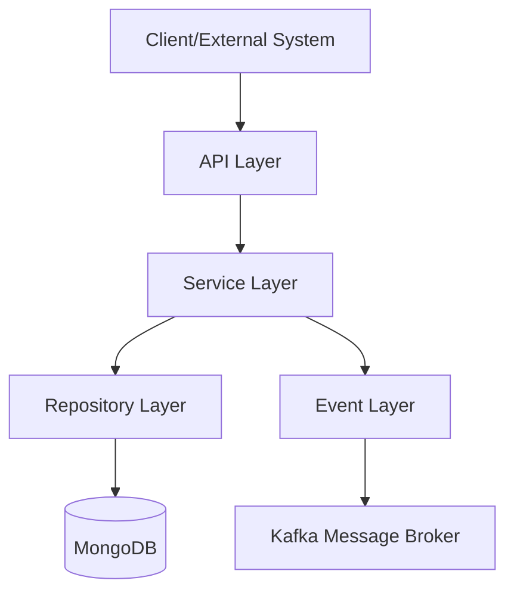
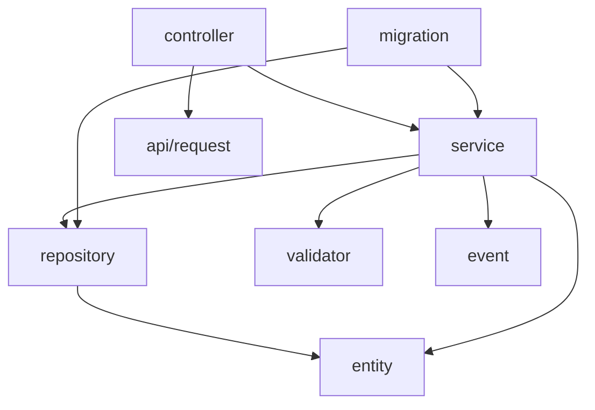
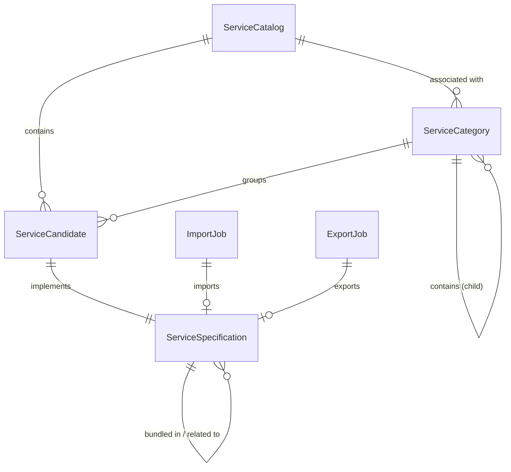

# 10 Deployment

## 10.1 Deployment Overview
The Service Catalog Management service follows a cloud-native, containerized deployment strategy. It is packaged as a Docker image and deployed within a Kubernetes environment, leveraging a microservices architecture.

## 10.2 CI/CD Pipeline
The CI/CD process is managed via a Jenkins pipeline (`Jenkinsfile`) with the following stages:
- **Init**: Initializes the Maven build pipeline.
- **Build Base Docker Image**: Constructs the initial container image.
- **Run Unit Tests**: Executes unit tests (conditional based on `RUN_UNITTESTS` environment variable).
- **Sonar Coverage & Run Unit Tests**: Performs static code analysis and coverage reporting via SonarCloud (conditional based on `RUN_SONAR`).
- **Detect Breaking Changes**: Checks for breaking changes on release branches.
- **Build Final Docker Image**: Constructs the final production-ready container image.
- **Scan Container Image**: Performs vulnerability scanning on `develop` and `release` branches.
- **Push Docker Images**: Pushes the finalized image to the GitHub Container Registry (`ghcr.io`).

## 10.3 Containerization
The application is containerized using a multi-stage Docker build:
- **Base Image**: The final runtime image is based on `eclipse-temurin:17.0.9_9-jre-focal`.
- **User**: Runs under a non-privileged system user `javauser` for security.
- **Entry Point**: The application is started using: `java -jar /app/app.jar`.
- **Network**: Exposes port `8080` by default.
- **Artifacts**: The JAR file is copied from a builder stage to `/app/app.jar`, and configuration files (`application.yml`, `pom.xml`) are stored in `/meta/`.

## 10.4 Infrastructure Requirements
### Software Requirements
- **Runtime**: Java 17 (JRE)
- **Framework**: Spring Boot 3.5.15
- **Build Tool**: Maven 3
- **Database**: MongoDB
- **Messaging**: Kafka
- **Identity Provider**: Keycloak

### Hardware Requirements (Build Time)
- **CPU**: 1750m (as specified in Kubernetes build pod)
- **Memory**: 7Gi (as specified in Kubernetes build pod)

## 10.5 Deployment Environments
The pipeline supports multiple target environments based on the branch type:
- **Development/Test**: Triggered by `develop` branches; includes vulnerability scanning.
- **Release/Production**: Triggered by `release` branches; includes breaking change detection and vulnerability scanning.
- **Registry**: All images are hosted on `ghcr.io`.
# 11. Frontend

## 11.1 Frontend Status
The project does not have an integrated frontend. The component is a backend-only API.

## 11.2 API Consumption
The API is consumed as a RESTful service. Based on the project root, it provides a Swagger/OpenAPI specification file (`TMF633-Service-Catalog-v4.0.0-swagger.json`) for API documentation and client generation.
# 1. Introduction

## 1.1 Project Overview
The Service Catalog Management system is a Java-based microservice developed using Spring Boot 3.5.15. It provides a comprehensive API for managing the entire lifecycle of service catalog elements, enabling the organization to define, manage, and maintain its offerings of services. The system leverages MongoDB for data persistence and Kafka for event-driven communication.

## 1.2 Goals and Objectives
The primary objective of the system is to provide a standardized interface for Service Catalog Management, aligning with the TMF633 Open API specification. The system aims to:
- Enable the full lifecycle management of service catalog elements.
- Ensure interoperability through adherence to TMF633 standards (as referenced in `TMF633-Service-Catalog-v4.0.0-swagger.json`).
- Provide a scalable architecture for cataloging services in a telecom-aligned environment.

## 1.3 Scope
The scope of this component includes:
- **REST API Layer**: Controllers and request DTOs for managing catalog elements (`com.pia.orbitant.servicecatalog.api`).
- **Business Logic**: Implementation of service catalog management rules (`com.pia.orbitant.servicecatalog.service`).
- **Data Access**: Repository patterns for MongoDB interaction (`com.pia.orbitant.servicecatalog.repository`) and domain entity definitions (`com.pia.orbitant.servicecatalog.data`).
- **Event Handling**: Architecture for publishing and consuming catalog-related events (`com.pia.orbitant.servicecatalog.event`).
- **Data Migration**: Logic for updating and migrating catalog data (`com.pia.orbitant.servicecatalog.migration`).

## 1.4 Intended Audience
This document is intended for:
- **Software Developers**: To understand the internal architecture and implementation details for maintenance and extension.
- **System Architects**: To review the alignment with TMF633 and the overall structural design.
- **QA Engineers**: To design test cases based on the described system behavior and API endpoints.
- **DevOps Engineers**: To understand the technology stack and deployment requirements.

## 1.5 Document Conventions
### 1.5.1 Key Terms
| Term | Definition |
| :--- | :--- |
| **TMF633** | TeleManagement Forum API for Service Catalog Management. |
| **SC** | Service Catalog (Short name for the service). |
| **DTO** | Data Transfer Object. |
| **Lifecycle Management** | The process of managing an entity from creation through modification to retirement. |

### 1.5.2 Formatting
- **Code references**: Package names and class names are presented in `monospace` font.
- **API Endpoints**: Represented as URL paths (e.g., `/api/serviceCatalogManagement/v4/`).
# 2. Architecture

## 2.1 Architectural Pattern
The Service Catalog Management system follows a **Layered Architecture** pattern. This pattern is chosen to ensure a clear separation of concerns, facilitating maintainability and scalability of the service catalog lifecycle management.

**Justification & Evidence:**
The codebase is organized into distinct packages that represent architectural layers:
- **API Layer**: `com.pia.orbitant.servicecatalog.api` contains REST controllers (e.g., `ServiceCatalogApi.java`) that handle HTTP requests and responses.
- **Service Layer**: `com.pia.orbitant.servicecatalog.service` contains business logic. Implementations like `ServiceCatalogServiceImpl.java` orchestrate the flow between the API and data layers.
- **Repository Layer**: `com.pia.orbitant.servicecatalog.repository` provides data access abstraction (e.g., `ServiceCatalogRepository.java` extending `BaseRepository`).
- **Event Layer**: `com.pia.orbitant.servicecatalog.event` handles asynchronous communication and event creation (e.g., `EventCreator.java`).

## 2.2 Component Diagram
The following Mermaid diagram describes the interaction between the architectural layers:



## 2.3 Data Flow
### Request-Response Flow
1. **Entry**: A client sends an HTTP request to an endpoint defined in the API layer (e.g., `POST /serviceCatalog` in `ServiceCatalogApi.java`).
2. **Processing**: The API layer delegates the request to the Service layer (e.g., `ServiceCatalogServiceImpl.createServiceCatalog`).
3. **Persistence**: The Service layer performs business validation and uses the Repository layer (e.g., `ServiceCatalogRepository.save()`) to persist data into MongoDB.
4. **Return**: The persisted entity is returned through the Service and API layers back to the client as a JSON response.

### Event Triggering Flow
- After a successful state-changing operation (Create, Update, Delete) or a retrieval operation, the Service layer calls the `EventService` using events generated by `EventCreator` (e.g., `eventService.create(EventCreator.createServiceCatalogCreateEvent(serviceCatalog))` in `ServiceCatalogServiceImpl.java:73`).
- These events are then published to the Kafka message broker for consumption by other system components.

## 2.4 Technology Stack Justification
- **Spring Boot 3.5.15**: Used as the core framework to provide rapid application development, dependency injection, and seamless integration with Spring Data MongoDB and Spring Kafka.
- **MongoDB**: Utilized as the primary database to handle the flexible schema requirements of service catalog entities, as evidenced by the use of `com.pia.orbitant.common.mongo` and `VersioningRepositoryForName`.
- **Kafka**: Employed for event-driven communication, enabling the system to notify other services of changes in the service catalog asynchronously.

## 2.5 Integration Points
- **Keycloak**: Used for identity and access management (IAM), verified by `testcontainers-keycloak` in the project configuration.
- **Camunda**: Integrated for business process orchestration, as referenced in the project README.
- **Common Core Libraries**: Integration with `com.pia.orbitant.common.core` for cross-cutting concerns like `AccessPolicyService`, `BusinessValidationService`, and `EventService`.
# 3. Package Structure

## 3.1 Package Hierarchy Map
```text
com.pia.orbitant.servicecatalog
├── api
│   └── request
├── controller
├── service
│   └── impl
├── repository
├── entity
│   ├── servicecatalog
│   ├── servicecandidate
│   ├── servicecategory
│   ├── job
│   └── servicespecification
├── validator
│   ├── servicecatalog
│   │   ├── common
│   │   ├── patch
│   │   └── post
│   ├── servicecandidate
│   │   ├── common
│   │   ├── patch
│   │   ├── delete
│   │   └── post
│   ├── servicecategory
│   │   ├── common
│   │   ├── patch
│   │   ├── delete
│   │   └── post
│   ├── helper
│   └── servicespecification
│       ├── common
│       ├── patch
│       ├── delete
│       └── post
├── event
│   ├── servicecatalog
│   │   └── payload
│   ├── servicecandidate
│   │   └── payload
│   ├── servicecategory
│   │   └── payload
│   └── servicespecification
│       └── payload
├── migration
│   ├── versioning
│   ├── importjob
│   ├── util
│   ├── aspect
│   ├── servicecatalog
│   ├── servicecandidate
│   ├── servicecategory
│   ├── exportjob
│   ├── servicespecification
│   └── exception
├── data
├── config
└── util
    └── validation
```

## 3.2 Package Responsibility Table

| Package | Primary Purpose |
| :--- | :--- |
| `com.pia.orbitant.servicecatalog.api` | Defines REST API request DTOs and external interface contracts. |
| `com.pia.orbitant.servicecatalog.controller` | REST API endpoints handling incoming HTTP requests and routing to services. |
| `com.pia.orbitant.servicecatalog.service` | Business logic interfaces and their implementations (`.impl`). |
| `com.pia.orbitant.servicecatalog.repository` | Data access layer for MongoDB persistence. |
| `com.pia.orbitant.servicecatalog.entity` | Domain models and MongoDB document entities. |
| `com.pia.orbitant.servicecatalog.validator` | Request validation logic categorized by entity and operation (post, patch, delete). |
| `com.pia.orbitant.servicecatalog.event` | Event-driven messaging components and payloads for asynchronous communication. |
| `com.pia.orbitant.servicecatalog.migration` | Logic for data import/export and versioning migrations. |
| `com.pia.orbitant.servicecatalog.config` | Application and framework configuration settings. |
| `com.pia.orbitant.servicecatalog.util` | General utility and helper classes. |

## 3.3 Dependency Graph
The application follows a layered architectural pattern:



**Dependency Flow:**
`api/request` $\rightarrow$ `controller` $\rightarrow$ `service` $\rightarrow$ (`repository` | `validator` | `event`) $\rightarrow$ `entity`

## 3.4 Key Class Locations

| Critical Class | Package |
| :--- | :--- |
| `ServiceCatalogApplication` | `com.pia.orbitant.servicecatalog` |
| `ServiceCatalogApiController` | `com.pia.orbitant.servicecatalog.controller` |
| `ServiceCatalogService` | `com.pia.orbitant.servicecatalog.service` |
| `ServiceCatalogRepository` | `com.pia.orbitant.servicecatalog.repository` |
| `ServiceCatalog` | `com.pia.orbitant.servicecatalog.entity.servicecatalog` |
| `ImportJobApiController` | `com.pia.orbitant.servicecatalog.controller` |
| `ExportJobService` | `com.pia.orbitant.servicecatalog.service` |
# 4. Entities

## 4.1 Entity Relationship Diagram



## 4.2 Entity Detail Tables

### ServiceCatalog
**MongoDB Collection:** `service-catalog`

| Field Name | Type | Description | Constraints |
| :--- | :--- | :--- | :--- |
| id | String | Unique identifier | Primary Key (inherited) |
| category | List\<ServiceCategoryRef\> | List of associated service categories | - |
| relatedParty | List\<RelatedParty\> | Parties or roles related to this catalog | - |
| catalogType | String | Identifier of the type of catalog | - |

### ServiceCategory
**MongoDB Collection:** `service-category`

| Field Name | Type | Description | Constraints |
| :--- | :--- | :--- | :--- |
| id | String | Unique identifier | Primary Key (inherited) |
| isRoot | Boolean | Indicates if this is a root category | - |
| parentId | String | Unique identifier of the parent category | - |
| parent | ServiceCategoryRef | Reference to the parent category | - |
| category | List\<ServiceCategoryRef\> | List of child categories | - |
| serviceCandidate | List\<ServiceCandidateRef\> | List of associated service candidates | - |

### ServiceCandidate
**MongoDB Collection:** `service-candidate`

| Field Name | Type | Description | Constraints |
| :--- | :--- | :--- | :--- |
| id | String | Unique identifier | Primary Key (inherited) |
| category | List\<ServiceCategoryRef\> | List of categories for this candidate | - |
| serviceSpecification | ServiceSpecificationRef | The specification implied by this candidate | - |

### ServiceSpecification
**MongoDB Collection:** `service-specification`

| Field Name | Type | Description | Constraints |
| :--- | :--- | :--- | :--- |
| id | String | Unique identifier | Primary Key (inherited) |
| isBundle | Boolean | Whether it represents a bundle of specifications | - |
| attachment | List\<AttachmentRefOrValue\> | Relevant attachments (pictures, docs) | - |
| constraint | List\<ConstraintRef\> | Applied constraint references | - |
| bundledServiceSpecification | List\<BundledServiceSpecification\> | Grouping of service specifications | - |
| entitySpecRelationship | List\<EntitySpecificationRelationship\> | Relationship to another specification | - |
| featureSpecification | List\<FeatureSpecification\> | List of features for this specification | - |
| relatedParty | List\<RelatedParty\> | Parties managing the specification | - |
| resourceSpecification | List\<ResourceSpecificationRef\> | Resource specifications (for RFSS) | - |
| serviceLevelSpecification | List\<ServiceLevelSpecificationRef\> | Related service level specifications | - |
| serviceSpecRelationship | List\<ServiceSpecRelationship\> | Related specifications (migration, etc.) | - |
| specCharacteristic | List\<CharacteristicSpecification\> | Characteristics the entity can take | - |
| targetEntitySchema | TargetEntitySchema | Pointer to target entity schema | - |
| pExtension | ServiceSpecificationExtension | Extended model attributes | - |

### ImportJob
**MongoDB Collection:** `import-job`

| Field Name | Type | Description | Constraints |
| :--- | :--- | :--- | :--- |
| id | String | Identifier of the import job | Primary Key |
| href | String | Reference of the import job | - |
| completionDate | OffsetDateTime | Date at which the job was completed | - |
| contentType | String | Format of the imported data | - |
| creationDate | OffsetDateTime | Date at which the job was created | - |
| errorLog | String | Reason for failure if status is failed | - |
| path | String | URL of the root resource for application | - |
| url | String | URL of the file containing data | - |
| status | String | Status (not started, running, succeeded, failed) | - |

### ExportJob
**MongoDB Collection:** `export-job`

| Field Name | Type | Description | Constraints |
| :--- | :--- | :--- | :--- |
| id | String | Identifier of the export job | Primary Key |
| href | String | Reference of the export job | - |
| completionDate | OffsetDateTime | Date at which the job was completed | - |
| contentType | String | Format of the exported data | - |
| creationDate | OffsetDateTime | Date at which the job was created | - |
| errorLog | String | Reason for failure | - |
| path | String | URL of root resource source | - |
| query | String | Scoping for exported data | - |
| url | String | URL of the file containing exported data | - |
| status | String | Status (not started, running, succeeded, failed) | - |

## 4.3 Inheritance Hierarchy

The system utilizes a layered inheritance model for entities to ensure consistency in metadata and auditability:

1. **BaseEntity**: The root base class providing polymorphism support via `@baseType` and `@type` fields.
2. **TenantEntity**: (Inherited by main business entities) Provides multi-tenancy context.
3. **TrackableBaseEntity**: Extends `BaseResource` to provide audit fields:
    - `createdDate`, `updatedDate`
    - `createdBy`, `updatedBy`
    - `revision` (Version field for optimistic locking)

**Hierarchy Map:**
`BaseEntity` $\rightarrow$ `TenantEntity` $\rightarrow$ (`ServiceCatalog`, `ServiceCategory`, `ServiceCandidate`, `ServiceSpecification`)

## 4.4 Validation Rules

Validation is implemented through a combination of JSR-303 annotations (e.g., `@Valid`, `@Validated`) and custom business validators located in `com.pia.orbitant.servicecatalog.validator`.

**Key Validation Rules for ServiceSpecification:**
- **Entity ID Check**: Verifies the validity of the entity ID before processing.
- **Date Range Validation**: Ensures `validFor` start and end dates are logically consistent.
- **Version Matching**: Validates that previous versions match for POST operations.
- **Lifecycle State**: Ensures the entity is in a valid state for the requested operation.
- **Creation Validation**: Applies specific constraints during the initial creation of a specification.
# 5. Services

## 5.1 Service Catalog
The following business services provide the core logic for managing the Service Catalog lifecycle.

| Service | Primary Responsibility |
| :--- | :--- |
| `ServiceCatalogService` | Manages the overall service catalog entities, including creation, retrieval, and versioning. |
| `ServiceSpecificationService` | Handles the definition and lifecycle of service specifications. |
| `ServiceCategoryService` | Manages the categorization of services within the catalog. |
| `ServiceCandidateService` | Manages service candidates awaiting promotion to the catalog. |
| `ImportJobService` | Coordinates the import of catalog data via asynchronous jobs. |
| `ExportJobService` | Coordinates the export of catalog data via asynchronous jobs. |

## 5.2 Method-Level Detail

### 5.2.1 ServiceCatalogService
| Method Name | Input Parameters | Output | Purpose |
| :--- | :--- | :--- | :--- |
| `createServiceCatalog` | `ServiceCatalogCreate` | `ServiceCatalog` | Creates a new service catalog entry. |
| `deleteServiceCatalog` | `String id, String version` | `void` | Deletes a specific version of a service catalog. |
| `listServiceCatalog` | `Clause filter, FindAllAttributesObject attributes` | `Page<ServiceCatalog>` | Retrieves a paginated list of service catalogs. |
| `patchServiceCatalog` | `String id, String version, ServiceCatalogUpdate` | `ServiceCatalog` | Updates a service catalog using a DTO. |
| `patchServiceCatalog` | `String id, String version, JsonPatch` | `ServiceCatalog` | Updates a service catalog using JSON Patch. |
| `retrieveServiceCatalog` | `String id, String version` | `ServiceCatalog` | Retrieves a specific version of a service catalog. |

### 5.2.2 ServiceSpecificationService
| Method Name | Input Parameters | Output | Purpose |
| :--- | :--- | :--- | :--- |
| `createServiceSpecification` | `ServiceSpecificationCreate` | `ServiceSpecification` | Creates a new service specification. |
| `deleteServiceSpecification` | `String id, String version` | `void` | Deletes a specific version of a service specification. |
| `listServiceSpecification` | `Clause filter, FindAllAttributesObject attributes` | `Page<ServiceSpecification>` | Retrieves a paginated list of specifications. |
| `patchServiceSpecification` | `String id, String version, ServiceSpecificationUpdate` | `ServiceSpecification` | Updates a specification using a DTO. |
| `jsonPatchServiceSpecification` | `String id, String version, JsonPatch` | `ServiceSpecification` | Updates a specification using JSON Patch. |
| `retrieveServiceSpecification` | `String id, String version` | `ServiceSpecification` | Retrieves a specific version of a specification. |

## 5.3 Business Logic Workflows

### 5.3.1 Service Specification Creation
1. **Validation**: The `BusinessValidationService` validates the `ServiceSpecificationCreate` DTO annotations.
2. **Tenancy Check**: `AccessPolicyService` verifies administrative tenancy.
3. **Entity Mapping**: A new `ServiceSpecification` entity is created and populated from the DTO.
4. **Owner Assignment**: `BaseValidation` ensures an owner is assigned if missing.
5. **Post-Validation**: The entity is validated again using `validateEntityOnPost`.
6. **Security**: An access policy constraint is generated and assigned to the entity.
7. **Persistence**: The entity is saved to the repository.
8. **Eventing**: A creation event is published via `EventService`.

### 5.3.2 Versioning and Patching
1. **Retrieval**: The existing entity is retrieved using `VersioningService.getEntity` based on `id` and `version`.
2. **Patch Application**: The `Patcher` component applies either a DTO update or a `JsonPatch` to the existing entity.
3. **State Preservation**: Access policy constraints and the `latestVersion` flag are preserved from the original entity.
4. **Validation**: The patched entity is validated via `businessValidationService.validateEntityOnPatch`.
5. **Version Update**: `VersioningService.patchEntity` handles the creation of a new version in the repository.
6. **Eventing**: A change event is published.

### 5.3.3 Import/Export Job Management
1. **Pre-Check**: `ImportExportValidationUtil` performs a pre-check on the request.
2. **ID Generation**: Uses the provided ID or generates a new UUID.
3. **Job Initialization**: A job entity is created with a status of "Not Started" and persisted.
4. **Asynchronous Execution**: The `ImportExportJobRunner` is triggered to start the actual data processing in the background.

## 5.4 Cross-Cutting Concerns

### 5.4.1 Validation (`BusinessValidationService`)
Services utilize `BusinessValidationService` at multiple stages:
- **DTO Validation**: `validateAnnotations` and `validateDtoOnPatch` ensure incoming requests are well-formed.
- **Entity Validation**: `validateEntityOnPost`, `validateEntityOnPatch`, and `validateEntityOnDelete` ensure business rules are maintained before persistence.

### 5.4.2 Authorization (`AccessPolicyService`)
Authorization is integrated via:
- **Tenancy Verification**: `checkAdminTenancyAndReturnToken` is used during creation to ensure the user has rights to the tenant.
- **Access Constraints**: `createAccessPolicyConstraint` is called to bind the entity to specific access rules.
- **Retrieval Check**: `validateTenancy` is called during `retrieve` operations to ensure the requester has access to the entity.

### 5.4.3 Event Publishing (`EventService`)
Every state-changing operation triggers an event:
- **Lifecycle Events**: Creation, deletion, and updates trigger specific events (e.g., `createServiceSpecificationCreateEvent`).
- **Read Events**: List and retrieve operations publish events for auditing or synchronization.
- **Transaction Sync**: In `ServiceSpecificationServiceImpl`, events are registered to be published specifically after the transaction commits using `TransactionSynchronizationManager`.
# 6. API Design

## 6.1 API Overview
The Service Catalog Management API is implemented following the REST (Representational State Transfer) architectural style. It provides a standardized interface for managing the lifecycle of service catalog elements, including categories, specifications, and candidates.

- **API Style**: REST
- **Base URL**: `/` (The application is hosted at the root context, with specific resource paths defined in the controllers)
- **Authentication**: The system integrates with Keycloak for identity and access management (IAM), as inferred from the technology stack. Standard Bearer token authentication is used for securing endpoints.
- **Data Format**: All requests and responses use `application/json;charset=utf-8`.

## 6.2 Endpoint Mapping Table

### Service Catalog API (`ServiceCatalogApiController`)
| Endpoint Path | Method | Request Body/Params | Response | Purpose |
| :--- | :--- | :--- | :--- | :--- |
| `/serviceCatalog` | POST | `ServiceCatalogCreate` | `ServiceCatalog` (201) | Creates a new Service Catalog entity. |
| `/serviceCatalog/{id}` | DELETE | `id` (Path), `version` (Query) | Void (204) | Deletes a Service Catalog entity. |
| `/serviceCatalog` | GET | `fields`, `offset`, `limit`, `sort` (Query) | `List<ServiceCatalog>` (200) | Lists or finds Service Catalog entities. |
| `/serviceCatalog/{id}` | PATCH | `id` (Path), `ServiceCatalogUpdate` (Body), `version` (Query) | `ServiceCatalog` (200) | Partially updates a Service Catalog entity via merge-patch. |
| `/serviceCatalog/{id}` | PATCH | `id` (Path), `JsonPatch` (Body), `version` (Query) | `ServiceCatalog` (200) | Partially updates a Service Catalog entity via JSON Patch. |
| `/serviceCatalog/{id}` | GET | `id` (Path), `fields` (Query), `version` (Query) | `ServiceCatalog` (200) | Retrieves a Service Catalog entity by ID. |

### Service Specification API (`ServiceSpecificationApiController`)
| Endpoint Path | Method | Request Body/Params | Response | Purpose |
| :--- | :--- | :--- | :--- | :--- |
| `/serviceSpecification` | POST | `ServiceSpecificationCreate` | `ServiceSpecification` (201) | Creates a new Service Specification entity. |
| `/serviceSpecification/{id}` | DELETE | `id` (Path), `version` (Query) | Void (204) | Deletes a Service Specification entity. |
| `/serviceSpecification` | GET | `fields`, `offset`, `limit`, `sort` (Query) | `List<ServiceSpecification>` (200) | Lists or finds Service Specification entities. |
| `/serviceSpecification/{id}` | PATCH | `id` (Path), `ServiceSpecificationUpdate` (Body), `version` (Query) | `ServiceSpecification` (200) | Partially updates a Service Specification entity via merge-patch. |
| `/serviceSpecification/{id}` | PATCH | `id` (Path), `JsonPatch` (Body), `version` (Query) | `ServiceSpecification` (200) | Partially updates a Service Specification entity via JSON Patch. |
| `/serviceSpecification/{id}` | GET | `id` (Path), `fields` (Query), `version` (Query) | `ServiceSpecification` (200) | Retrieves a Service Specification entity by ID. |

### Service Category API (`ServiceCategoryApiController`)
| Endpoint Path | Method | Request Body/Params | Response | Purpose |
| :--- | :--- | :--- | :--- | :--- |
| `/serviceCategory` | POST | `ServiceCategoryCreate` | `ServiceCategory` (201) | Creates a new Service Category entity. |
| `/serviceCategory/{id}` | DELETE | `id` (Path), `version` (Query) | Void (204) | Deletes a Service Category entity. |
| `/serviceCategory` | GET | `fields`, `offset`, `limit`, `sort` (Query) | `List<ServiceCategory>` (200) | Lists or finds Service Category entities. |
| `/serviceCategory/{id}` | PATCH | `id` (Path), `ServiceCategoryUpdate` (Body), `version` (Query) | `ServiceCategory` (200) | Partially updates a Service Category entity via merge-patch. |
| `/serviceCategory/{id}` | PATCH | `id` (Path), `JsonPatch` (Body), `version` (Query) | `ServiceCategory` (200) | Partially updates a Service Category entity via JSON Patch. |
| `/serviceCategory/{id}` | GET | `id` (Path), `fields` (Query), `version` (Query) | `ServiceCategory` (200) | Retrieves a Service Category entity by ID. |

### Service Candidate API (`ServiceCandidateApiController`)
| Endpoint Path | Method | Request Body/Params | Response | Purpose |
| :--- | :--- | :--- | :--- | :--- |
| `/serviceCandidate` | POST | `ServiceCandidateCreate` | `ServiceCandidate` (201) | Creates a new Service Candidate entity. |
| `/serviceCandidate/{id}` | DELETE | `id` (Path), `version` (Query) | Void (204) | Deletes a Service Candidate entity. |
| `/serviceCandidate` | GET | `fields`, `offset`, `limit`, `sort` (Query) | `List<ServiceCandidate>` (200) | Lists or finds Service Candidate entities. |
| `/serviceCandidate/{id}` | PATCH | `id` (Path), `ServiceCandidateUpdate` (Body), `version` (Query) | `ServiceCandidate` (200) | Partially updates a Service Candidate entity via merge-patch. |
| `/serviceCandidate/{id}` | PATCH | `id` (Path), `JsonPatch` (Body), `version` (Query) | `ServiceCandidate` (200) | Partially updates a Service Candidate entity via JSON Patch. |
| `/serviceCandidate/{id}` | GET | `id` (Path), `fields` (Query), `version` (Query) | `ServiceCandidate` (200) | Retrieves a Service Candidate entity by ID. |

### Hub API (`HubApiController`)
| Endpoint Path | Method | Request Body/Params | Response | Purpose |
| :--- | :--- | :--- | :--- | :--- |
| `/hub` | POST | `EventSubscriptionInput` | `EventSubscription` (201) | Registers a listener for event notifications. |
| `/hub/{id}` | DELETE | `id` (Path) | Void (204) | Unregisters a listener. |

### Import Job API (`ImportJobApiController`)
| Endpoint Path | Method | Request Body/Params | Response | Purpose |
| :--- | :--- | :--- | :--- | :--- |
| `/importJob` | POST | `ImportJobCreate` | `ImportJob` (201) | Creates a new Import Job entity. |
| `/importJob/{id}` | DELETE | `id` (Path) | Void (204) | Deletes an Import Job entity. |
| `/importJob` | GET | `fields`, `offset`, `limit`, `sort` (Query) | `List<ImportJob>` (200) | Lists or finds Import Job entities. |
| `/importJob/{id}` | GET | `id` (Path), `fields` (Query) | `ImportJob` (200) | Retrieves an Import Job entity by ID. |

### Export Job API (`ExportJobApiController`)
| Endpoint Path | Method | Request Body/Params | Response | Purpose |
| :--- | :--- | :--- | :--- | :--- |
| `/exportJob` | POST | `ExportJobCreate` | `ExportJob` (201) | Creates a new Export Job entity. |
| `/exportJob/{id}` | DELETE | `id` (Path) | Void (204) | Deletes an Export Job entity. |
| `/exportJob` | GET | `fields`, `offset`, `limit`, `sort` (Query) | `List<ExportJob>` (200) | Lists or finds Export Job entities. |
| `/exportJob/{id}` | GET | `id` (Path), `fields` (Query) | `ExportJob` (200) | Retrieves an Export Job entity by ID. |

## 6.3 Request/Response Models
The API utilizes Data Transfer Objects (DTOs) to separate the internal domain model from the external API contract. Key models include:

| Model | Type | Description |
| :--- | :--- | :--- |
| `ServiceCatalogCreate` / `ServiceCatalogUpdate` | Request | DTOs for creating and updating Service Catalog elements. |
| `ServiceSpecificationCreate` / `ServiceSpecificationUpdate` | Request | DTOs for creating and updating Service Specifications. |
| `ServiceCategoryCreate` / `ServiceCategoryUpdate` | Request | DTOs for creating and updating Service Categories. |
| `ServiceCandidateCreate` / `ServiceCandidateUpdate` | Request | DTOs for creating and updating Service Candidates. |
| `ImportJobCreate` | Request | DTO for initiating a data import job. |
| `ExportJobCreate` | Request | DTO for initiating a data export job. |
| `EventSubscriptionInput` | Request | DTO for registering event listener callback endpoints. |
| `ServiceCatalog` / `ServiceSpecification` / etc. | Response | Domain entities returned as JSON responses. |

## 6.4 Error Handling
The API implements a global error handling mechanism utilizing `OrbitantException` and a standard `Error` response model. When an error occurs, the system returns a consistent JSON error object containing a descriptive message and the corresponding HTTP status code.

### Standard Error Response Codes
| Status Code | Meaning | Description |
| :--- | :--- | :--- |
| 400 | Bad Request | The request is malformed or fails validation. |
| 401 | Unauthorized | Authentication is required or has failed. |
| 403 | Forbidden | The authenticated user lacks the necessary permissions. |
| 404 | Not Found | The requested resource could not be found. |
| 405 | Method Not Allowed | The HTTP method is not supported for this endpoint. |
| 409 | Conflict | The request conflicts with the current state of the resource. |
| 500 | Internal Server Error | An unexpected server-side error occurred. |

## 6.5 Versioning Strategy
The API currently employs a versioning strategy that allows for resource-specific versioning via query parameters.
- **Query Parameter Versioning**: The `version` query parameter is used in `GET`, `PATCH`, and `DELETE` operations (e.g., `/serviceCatalog/{id}?version=1.0`) to allow clients to interact with specific versions of a resource.
- **URL Versioning**: While the current controllers do not show a global version prefix in `@RequestMapping`, the underlying Swagger definitions (e.g., `TMF633-Service-Catalog-v4.0.0-swagger.json`) indicate alignment with TMF (TeleManagement Forum) versioned standards.
# 7. Database

## 7.1 Database Overview
The system utilizes **MongoDB**, a document-oriented NoSQL database. This choice supports a flexible, schema-less data model, which is essential for managing service catalog elements that may have varying attributes and complex nested structures (e.g., characteristics and bundled specifications). The data model follows a document-oriented approach, allowing related data to be stored together in single documents to optimize read performance and simplify the representation of hierarchical relationships.

## 7.2 Collection Mapping

| MongoDB Collection | Java Entity | Primary Purpose |
| :--- | :--- | :--- |
| `serviceSpecification` | `ServiceSpecification` | Stores definitions of services, including characteristics and relationships. |
| `serviceCategory` | `ServiceCategory` | Manages the categorization of services for catalog organization. |
| `serviceCatalog` | `ServiceCatalog` | Defines specific service catalogs and their associated categories. |
| `serviceCandidate` | `ServiceCandidate` | Tracks service specifications that are candidates for publication in catalogs. |
| `importJob` | `ImportJob` | Maintains state and logs for data import operations. |
| `exportJob` | `ExportJob` | Maintains state and logs for data export operations. |
| `entitySpecification` | `EntitySpecification` | Defines generic templates for bespoke business entities. |
| `entitySpecificationRelationship` | `EntitySpecificationRelationship` | Stores relationships (migration, dependency, etc.) between entity specifications. |

## 7.3 Indexing Strategy
The system relies primarily on the primary key index provided by MongoDB (`_id`). Specialized queries are handled via Spring Data MongoDB `@Query` annotations in the repositories, targeting:
- **Relationship lookups**: Indices on `serviceSpecRelationship.id` and `serviceSpecRelationship.version` in `ServiceSpecificationRepository`.
- **Candidate lookups**: Indices on `serviceSpecification.id` and `serviceSpecification.version` in `ServiceCandidateRepository`.
- **Category lookups**: Indices on `serviceCandidate.id` and `serviceCandidate.version` in `ServiceCategoryRepository`.

## 7.4 Transaction Management
Transaction management is handled via Spring's `@Transactional` abstraction. Given MongoDB's nature, consistency is managed at the document level. For operations spanning multiple collections, the system utilizes MongoDB multi-document transactions (where supported by the deployment) to ensure atomicity, particularly during complex import/export jobs.

## 7.5 Data Versioning and Auditing
The system implements a robust versioning and auditing mechanism:
- **Versioning**: Entities extend `VersionEntity` (via `BaseResource`), implementing a versioning strategy that tracks revisions. Repositories extend `VersioningRepositoryForName`, enabling the retrieval of specific versions or the latest active version of a resource.
- **Auditing**: 
    - `lastUpdate`: Tracked in `BaseResource` and `EntitySpecification` to store the date and time of the last modification.
    - **Lifecycle Tracking**: The `lifecycleStatus` field (e.g., `IN_STUDY`) is used to track the state of the entity throughout its lifecycle.
    - **Timestamps**: `BaseResource.setUpdateDefaults()` ensures the `lastUpdate` field is refreshed on every update operation.
# 8. Configuration

## 8.1 Configuration Overview
The Service Catalog Management application uses a Spring Boot-based configuration mechanism. The primary configuration is defined in `src/main/resources/application.yml`. The application utilizes a combination of hardcoded defaults and environment variable placeholders (e.g., `${SPRING_KAFKA_BOOTSTRAP_SERVERS}`), allowing for flexible deployment across different environments.

## 8.2 Key Configuration Parameters

| Parameter | Description | Default/Example Value |
| :--- | :--- | :--- |
| `SERVER_PORT` | The port on which the server listens | `8083` |
| `SERVER_SERVLET_CONTEXT_PATH` | Base URI path for the API | `/api/serviceCatalogManagement/v4/` |
| `SPRING_DATA_MONGODB_INET_ADDRESS` | Connection URI for MongoDB | `mongodb://mongodb:27017` |
| `SPRING_DATA_MONGODB_DATABASE` | Name of the MongoDB database | `service_catalog` |
| `SPRING_KAFKA_BOOTSTRAP_SERVERS` | Kafka cluster bootstrap servers | `http://kafka:9092` |
| `SECURITY_JWK_SET_URI` | Keycloak JWK set URI for token validation | `https://dnext.dev.orbitant.dev/realms/.../certs` |
| `APPLICATION_S2S_AUTH_URL` | S2S authentication token endpoint | `https://dnext.dev.orbitant.dev/realms/.../token` |
| `APPLICATION_S2S_CLIENT_ID` | Client ID for S2S authentication | `orbitant-backend-client` |
| `ACCESS_CONTROL_API_URL` | API URL for roles and permissions management | `http://dnext-drapms-roles-userpermissions-mgmt-srvc/...` |
| `CONFIGURED_VALUE_SERVICE_URL` | URL for dynamic configuration service | `http://dnext-dcfms-configuration-mgmt-srvc/...` |

## 8.3 Environment Profiles
The application is designed to support multiple profiles. While a single `application.yml` is provided with "dev-boxes" configurations, the use of environment variables indicates a pattern for `dev`, `test`, and `prod` profiles.
- **Dev**: Uses local/dev cluster addresses (e.g., `mongodb:27017`, `kafka:9092`).
- **Test/Prod**: Overridden via environment variables in the deployment pipeline (Jenkins).

## 8.4 Secret Management
Sensitive data is managed through the following mechanisms:
- **Environment Variables**: Secrets such as `SPRING_DATA_MONGODB_PASSWORD` and `APPLICATION_S2S_CLIENT_SECRET` are externalized as environment variables to avoid committing them to source control.
- **Password Protection**: `SPRING_DATA_MONGODB_PASSWORD_PROTECTION_ENABLED` is set to `true` to enable additional security for database credentials.
- **Log Obfuscation**: The `logbook` configuration explicitly obfuscates sensitive headers (`Authorization`, `X-Secret`) and parameters (`access_token`, `password`) in the logs.

## 8.5 Dynamic Configuration
The application supports dynamic configuration through the `configured-value` mechanism:
- **Dynamic Service**: Integration with `dnext-dcfms-configuration-mgmt-srvc` via `CONFIGURED_VALUE_SERVICE_URL`.
- **Refresh Mechanism**: A refresh interval is defined (`configured-value.refresh: 3600000` ms), allowing the application to update specific settings (e.g., `lifecycleStatus`, `jobStateType`) without a restart.
# 9. Testing

## 9.1 Testing Strategy
The project employs a multi-level testing strategy to ensure the reliability and correctness of the Service Catalog Management API:
- **Unit Testing**: Focused on individual components, validators, and utility classes to verify business logic in isolation.
- **Integration Testing**: Validates the interaction between the application and its external dependencies (MongoDB, Kafka, Keycloak) using a real-world infrastructure simulation.
- **API/End-to-End Testing**: Uses `MockMvc` and `TestRestTemplate` to verify REST endpoints, request/response payloads, and overall system behavior from the client perspective.

## 9.2 Test Frameworks
The following frameworks and libraries are utilized for testing:
- **JUnit 5 (Jupiter)**: Primary testing framework for writing and executing tests.
- **Spring Boot Test**: Provides integration testing support, including `@SpringBootTest` and `@AutoConfigureMockMvc`.
- **Mockito**: Used for mocking dependencies and simulating object behavior.
- **Testcontainers**: Used to manage ephemeral Docker containers for external dependencies.
- **JaCoCo**: Integrated via Maven plugin for measuring code coverage.

## 9.3 Test Case Analysis
The test suite is organized into several key areas:
- **Controller Tests**: (e.g., `ServiceCatalogControllerTest`, `ServiceCategoryControllerTest`, `ServiceSpecificationControllerTest`) Verify REST API contracts, HTTP status codes, and JSON responses.
- **Service & Validator Tests**: (e.g., `ServiceCatalogLCStateForPatchValidatorTest`, `ServiceCatalogAclRelatedPartyTest`) Ensure business rules, lifecycle state transitions, and access control logic are correctly implemented.
- **Security & Tenant Tests**: (e.g., `ServiceCatalogTenantIdControllerTest`, `ServiceCatalogControllerOrganizationIdTest`) Verify that data is correctly partitioned by tenant and organization IDs.
- **Event Testing**: (`EventListenerTest`) Validates the processing of asynchronous events.
- **Multi-Organization Tests**: (e.g., `ServiceSpecificationMultiOrganizationIdTest`) Ensures correct behavior across multiple organizations.

## 9.4 Integration Testing Approach
External dependencies are simulated using **Testcontainers** to provide a consistent and isolated environment:
- **MongoDB**: A `MongoDBContainer` is used to run a real MongoDB instance, ensuring data access layers are tested against actual database behavior.
- **Kafka**: A `KafkaContainer` is utilized to verify event production and consumption.
- **Keycloak**: A `KeycloakContainer` is employed to simulate the Identity and Access Management (IAM) provider, including the import of a predefined realm (`orbitant-realm.json`) for authentication and authorization tests.
- **Dynamic Configuration**: The `AbstractTestBase` class uses `@DynamicPropertySource` to inject the dynamically assigned ports and URLs from these containers into the Spring application properties.

## 9.5 Test Coverage
Code coverage is managed using the **JaCoCo Maven Plugin**. To ensure meaningful metrics, certain layers are excluded from coverage reports:
- Domain models (`**/data/**`)
- Entities (`**/entity/**`)
- Data migration logic (`**/migration/**`)
