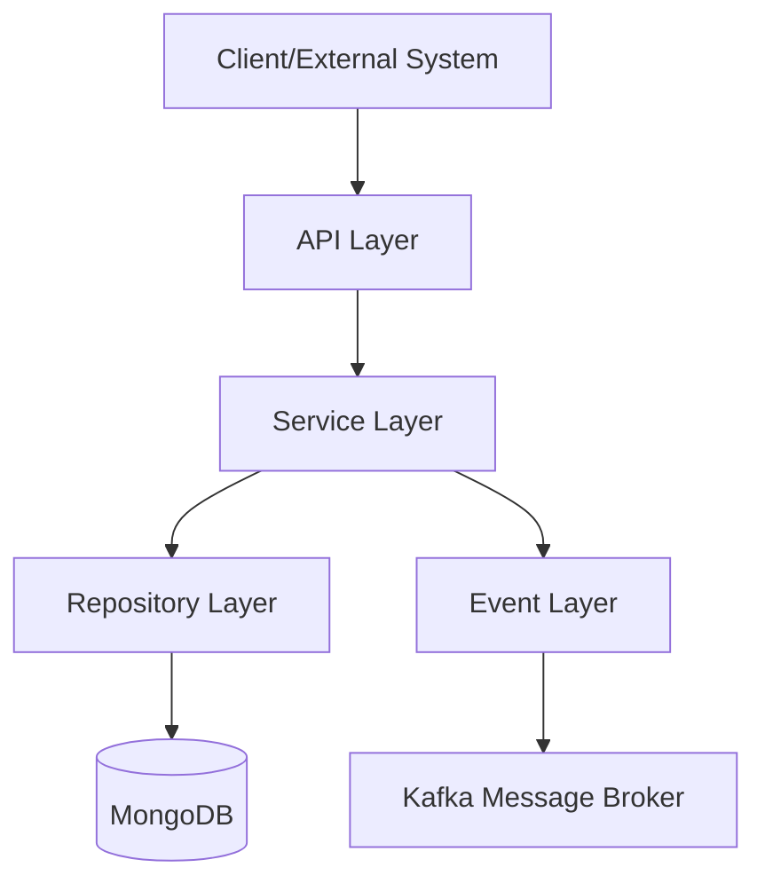

# 2. Architecture

## 2.1 Architectural Pattern
The Service Catalog Management system follows a **Layered Architecture** pattern. This pattern is chosen to ensure a clear separation of concerns, facilitating maintainability and scalability of the service catalog lifecycle management.

**Justification & Evidence:**
The codebase is organized into distinct packages that represent architectural layers:
- **API Layer**: `com.pia.orbitant.servicecatalog.api` contains REST controllers (e.g., `ServiceCatalogApi.java`) that handle HTTP requests and responses.
- **Service Layer**: `com.pia.orbitant.servicecatalog.service` contains business logic. Implementations like `ServiceCatalogServiceImpl.java` orchestrate the flow between the API and data layers.
- **Repository Layer**: `com.pia.orbitant.servicecatalog.repository` provides data access abstraction (e.g., `ServiceCatalogRepository.java` extending `BaseRepository`).
- **Event Layer**: `com.pia.orbitant.servicecatalog.event` handles asynchronous communication and event creation (e.g., `EventCreator.java`).

## 2.2 Component Diagram
The following Mermaid diagram describes the interaction between the architectural layers:

## 2.3 Data Flow
### Request-Response Flow
1. **Entry**: A client sends an HTTP request to an endpoint defined in the API layer (e.g., `POST /serviceCatalog` in `ServiceCatalogApi.java`).
2. **Processing**: The API layer delegates the request to the Service layer (e.g., `ServiceCatalogServiceImpl.createServiceCatalog`).
3. **Persistence**: The Service layer performs business validation and uses the Repository layer (e.g., `ServiceCatalogRepository.save()`) to persist data into MongoDB.
4. **Return**: The persisted entity is returned through the Service and API layers back to the client as a JSON response.

### Event Triggering Flow
- After a successful state-changing operation (Create, Update, Delete) or a retrieval operation, the Service layer calls the `EventService` using events generated by `EventCreator` (e.g., `eventService.create(EventCreator.createServiceCatalogCreateEvent(serviceCatalog))` in `ServiceCatalogServiceImpl.java:73`).
- These events are then published to the Kafka message broker for consumption by other system components.

## 2.4 Technology Stack Justification
- **Spring Boot 3.5.15**: Used as the core framework to provide rapid application development, dependency injection, and seamless integration with Spring Data MongoDB and Spring Kafka.
- **MongoDB**: Utilized as the primary database to handle the flexible schema requirements of service catalog entities, as evidenced by the use of `com.pia.orbitant.common.mongo` and `VersioningRepositoryForName`.
- **Kafka**: Employed for event-driven communication, enabling the system to notify other services of changes in the service catalog asynchronously.

## 2.5 Integration Points
- **Keycloak**: Used for identity and access management (IAM), verified by `testcontainers-keycloak` in the project configuration.
- **Camunda**: Integrated for business process orchestration, as referenced in the project README.
- **Common Core Libraries**: Integration with `com.pia.orbitant.common.core` for cross-cutting concerns like `AccessPolicyService`, `BusinessValidationService`, and `EventService`.
