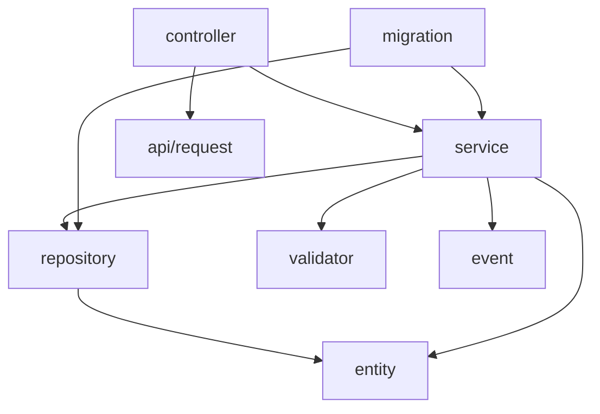

# 3. Package Structure

## 3.1 Package Hierarchy Map
```text
com.pia.orbitant.servicecatalog
├── api
│   └── request
├── controller
├── service
│   └── impl
├── repository
├── entity
│   ├── servicecatalog
│   ├── servicecandidate
│   ├── servicecategory
│   ├── job
│   └── servicespecification
├── validator
│   ├── servicecatalog
│   │   ├── common
│   │   ├── patch
│   │   └── post
│   ├── servicecandidate
│   │   ├── common
│   │   ├── patch
│   │   ├── delete
│   │   └── post
│   ├── servicecategory
│   │   ├── common
│   │   ├── patch
│   │   ├── delete
│   │   └── post
│   ├── helper
│   └── servicespecification
│       ├── common
│       ├── patch
│       ├── delete
│       └── post
├── event
│   ├── servicecatalog
│   │   └── payload
│   ├── servicecandidate
│   │   └── payload
│   ├── servicecategory
│   │   └── payload
│   └── servicespecification
│       └── payload
├── migration
│   ├── versioning
│   ├── importjob
│   ├── util
│   ├── aspect
│   ├── servicecatalog
│   ├── servicecandidate
│   ├── servicecategory
│   ├── exportjob
│   ├── servicespecification
│   └── exception
├── data
├── config
└── util
    └── validation
```

## 3.2 Package Responsibility Table

| Package | Primary Purpose |
| :--- | :--- |
| `com.pia.orbitant.servicecatalog.api` | Defines REST API request DTOs and external interface contracts. |
| `com.pia.orbitant.servicecatalog.controller` | REST API endpoints handling incoming HTTP requests and routing to services. |
| `com.pia.orbitant.servicecatalog.service` | Business logic interfaces and their implementations (`.impl`). |
| `com.pia.orbitant.servicecatalog.repository` | Data access layer for MongoDB persistence. |
| `com.pia.orbitant.servicecatalog.entity` | Domain models and MongoDB document entities. |
| `com.pia.orbitant.servicecatalog.validator` | Request validation logic categorized by entity and operation (post, patch, delete). |
| `com.pia.orbitant.servicecatalog.event` | Event-driven messaging components and payloads for asynchronous communication. |
| `com.pia.orbitant.servicecatalog.migration` | Logic for data import/export and versioning migrations. |
| `com.pia.orbitant.servicecatalog.config` | Application and framework configuration settings. |
| `com.pia.orbitant.servicecatalog.util` | General utility and helper classes. |

## 3.3 Dependency Graph
The application follows a layered architectural pattern:



**Dependency Flow:**
`api/request` $\rightarrow$ `controller` $\rightarrow$ `service` $\rightarrow$ (`repository` | `validator` | `event`) $\rightarrow$ `entity`

## 3.4 Key Class Locations

| Critical Class | Package |
| :--- | :--- |
| `ServiceCatalogApplication` | `com.pia.orbitant.servicecatalog` |
| `ServiceCatalogApiController` | `com.pia.orbitant.servicecatalog.controller` |
| `ServiceCatalogService` | `com.pia.orbitant.servicecatalog.service` |
| `ServiceCatalogRepository` | `com.pia.orbitant.servicecatalog.repository` |
| `ServiceCatalog` | `com.pia.orbitant.servicecatalog.entity.servicecatalog` |
| `ImportJobApiController` | `com.pia.orbitant.servicecatalog.controller` |
| `ExportJobService` | `com.pia.orbitant.servicecatalog.service` |
