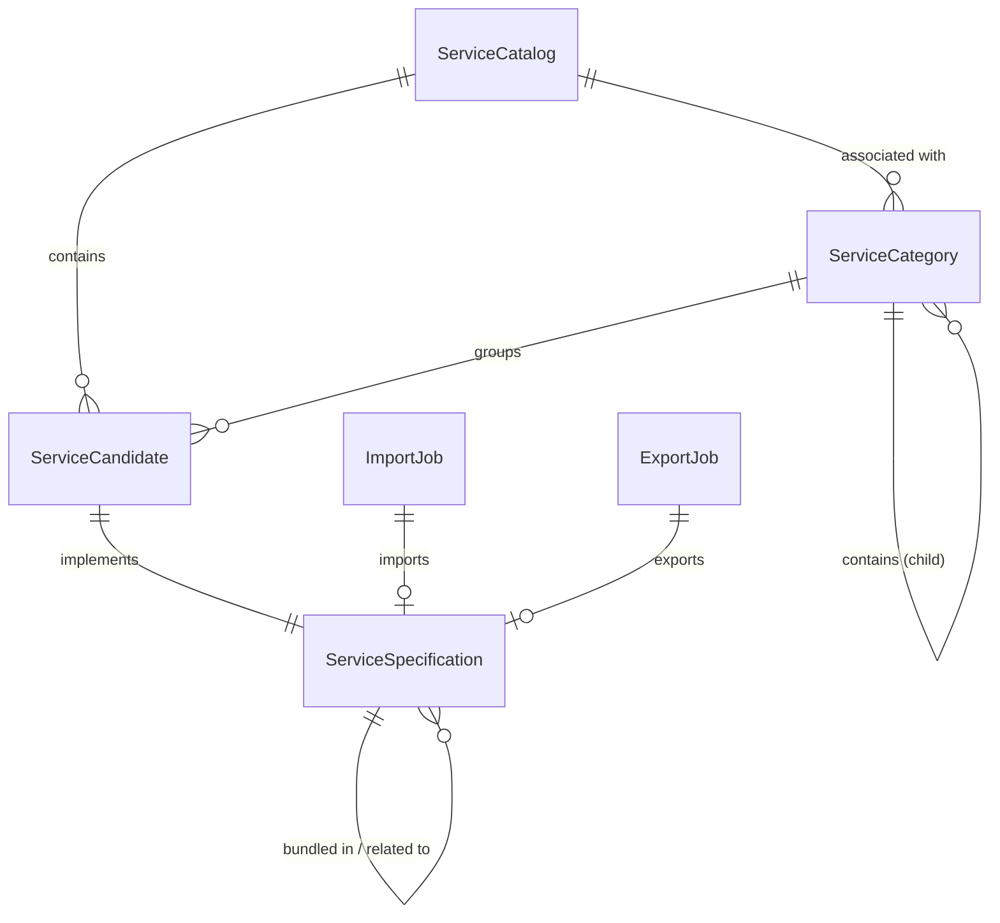

# 4. Entities

## 4.1 Entity Relationship Diagram

## 4.2 Entity Detail Tables

### ServiceCatalog
**MongoDB Collection:** `service-catalog`

| Field Name | Type | Description | Constraints |
| :--- | :--- | :--- | :--- |
| id | String | Unique identifier | Primary Key (inherited) |
| category | List\<ServiceCategoryRef\> | List of associated service categories | - |
| relatedParty | List\<RelatedParty\> | Parties or roles related to this catalog | - |
| catalogType | String | Identifier of the type of catalog | - |

### ServiceCategory
**MongoDB Collection:** `service-category`

| Field Name | Type | Description | Constraints |
| :--- | :--- | :--- | :--- |
| id | String | Unique identifier | Primary Key (inherited) |
| isRoot | Boolean | Indicates if this is a root category | - |
| parentId | String | Unique identifier of the parent category | - |
| parent | ServiceCategoryRef | Reference to the parent category | - |
| category | List\<ServiceCategoryRef\> | List of child categories | - |
| serviceCandidate | List\<ServiceCandidateRef\> | List of associated service candidates | - |

### ServiceCandidate
**MongoDB Collection:** `service-candidate`

| Field Name | Type | Description | Constraints |
| :--- | :--- | :--- | :--- |
| id | String | Unique identifier | Primary Key (inherited) |
| category | List\<ServiceCategoryRef\> | List of categories for this candidate | - |
| serviceSpecification | ServiceSpecificationRef | The specification implied by this candidate | - |

### ServiceSpecification
**MongoDB Collection:** `service-specification`

| Field Name | Type | Description | Constraints |
| :--- | :--- | :--- | :--- |
| id | String | Unique identifier | Primary Key (inherited) |
| isBundle | Boolean | Whether it represents a bundle of specifications | - |
| attachment | List\<AttachmentRefOrValue\> | Relevant attachments (pictures, docs) | - |
| constraint | List\<ConstraintRef\> | Applied constraint references | - |
| bundledServiceSpecification | List\<BundledServiceSpecification\> | Grouping of service specifications | - |
| entitySpecRelationship | List\<EntitySpecificationRelationship\> | Relationship to another specification | - |
| featureSpecification | List\<FeatureSpecification\> | List of features for this specification | - |
| relatedParty | List\<RelatedParty\> | Parties managing the specification | - |
| resourceSpecification | List\<ResourceSpecificationRef\> | Resource specifications (for RFSS) | - |
| serviceLevelSpecification | List\<ServiceLevelSpecificationRef\> | Related service level specifications | - |
| serviceSpecRelationship | List\<ServiceSpecRelationship\> | Related specifications (migration, etc.) | - |
| specCharacteristic | List\<CharacteristicSpecification\> | Characteristics the entity can take | - |
| targetEntitySchema | TargetEntitySchema | Pointer to target entity schema | - |
| pExtension | ServiceSpecificationExtension | Extended model attributes | - |

### ImportJob
**MongoDB Collection:** `import-job`

| Field Name | Type | Description | Constraints |
| :--- | :--- | :--- | :--- |
| id | String | Identifier of the import job | Primary Key |
| href | String | Reference of the import job | - |
| completionDate | OffsetDateTime | Date at which the job was completed | - |
| contentType | String | Format of the imported data | - |
| creationDate | OffsetDateTime | Date at which the job was created | - |
| errorLog | String | Reason for failure if status is failed | - |
| path | String | URL of the root resource for application | - |
| url | String | URL of the file containing data | - |
| status | String | Status (not started, running, succeeded, failed) | - |

### ExportJob
**MongoDB Collection:** `export-job`

| Field Name | Type | Description | Constraints |
| :--- | :--- | :--- | :--- |
| id | String | Identifier of the export job | Primary Key |
| href | String | Reference of the export job | - |
| completionDate | OffsetDateTime | Date at which the job was completed | - |
| contentType | String | Format of the exported data | - |
| creationDate | OffsetDateTime | Date at which the job was created | - |
| errorLog | String | Reason for failure | - |
| path | String | URL of root resource source | - |
| query | String | Scoping for exported data | - |
| url | String | URL of the file containing exported data | - |
| status | String | Status (not started, running, succeeded, failed) | - |

## 4.3 Inheritance Hierarchy

The system utilizes a layered inheritance model for entities to ensure consistency in metadata and auditability:

1. **BaseEntity**: The root base class providing polymorphism support via `@baseType` and `@type` fields.
2. **TenantEntity**: (Inherited by main business entities) Provides multi-tenancy context.
3. **TrackableBaseEntity**: Extends `BaseResource` to provide audit fields:
    - `createdDate`, `updatedDate`
    - `createdBy`, `updatedBy`
    - `revision` (Version field for optimistic locking)

**Hierarchy Map:**
`BaseEntity` $\rightarrow$ `TenantEntity` $\rightarrow$ (`ServiceCatalog`, `ServiceCategory`, `ServiceCandidate`, `ServiceSpecification`)

## 4.4 Validation Rules

Validation is implemented through a combination of JSR-303 annotations (e.g., `@Valid`, `@Validated`) and custom business validators located in `com.pia.orbitant.servicecatalog.validator`.

**Key Validation Rules for ServiceSpecification:**
- **Entity ID Check**: Verifies the validity of the entity ID before processing.
- **Date Range Validation**: Ensures `validFor` start and end dates are logically consistent.
- **Version Matching**: Validates that previous versions match for POST operations.
- **Lifecycle State**: Ensures the entity is in a valid state for the requested operation.
- **Creation Validation**: Applies specific constraints during the initial creation of a specification.
