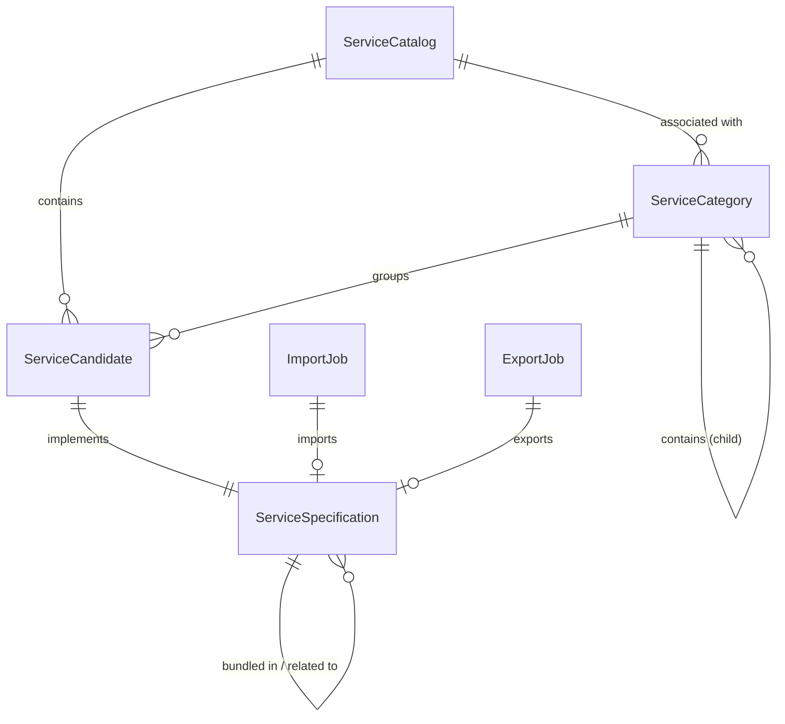

# 7. Data Model Summary

This section provides a detailed summary of the data model used in the Service Catalog system. The system utilizes a NoSQL approach with MongoDB, employing a layered inheritance model to ensure consistency across business entities.

## 7.1 Entity Relationship Diagram

## 7.2 Primary Entities

### 7.2.1 ServiceCatalog
**Description:** Represents a collection of services organized by categories.
- **Primary Key:** `id` (String)
- **Attributes:**
    - `category` (List\<ServiceCategoryRef\>): List of associated service categories.
    - `relatedParty` (List\<RelatedParty\>): Parties or roles related to this catalog.
    - `catalogType` (String): Identifier of the type of catalog.
- **Relationships:**
    - 1:N with `ServiceCategory`
    - 1:N with `ServiceCandidate`

### 7.2.2 ServiceCategory
**Description:** Provides a hierarchical grouping mechanism for service candidates.
- **Primary Key:** `id` (String)
- **Attributes:**
    - `isRoot` (Boolean): Indicates if this is a root category.
    - `parentId` (String): Unique identifier of the parent category.
    - `parent` (ServiceCategoryRef): Reference to the parent category.
    - `category` (List\<ServiceCategoryRef\>): List of child categories.
    - `serviceCandidate` (List\<ServiceCandidateRef\>): List of associated service candidates.
- **Relationships:**
    - 1:N with `ServiceCategory` (Self-relationship for hierarchy)
    - 1:N with `ServiceCandidate`
    - N:1 with `ServiceCatalog`

### 7.2.3 ServiceCandidate
**Description:** A candidate service that implements a specific service specification.
- **Primary Key:** `id` (String)
- **Attributes:**
    - `category` (List\<ServiceCategoryRef\>): List of categories for this candidate.
    - `serviceSpecification` (ServiceSpecificationRef): The specification implied by this candidate.
- **Relationships:**
    - 1:1 with `ServiceSpecification`
    - N:M with `ServiceCategory`
    - N:1 with `ServiceCatalog`

### 7.2.4 ServiceSpecification
**Description:** Defines the technical and business characteristics of a service.
- **Primary Key:** `id` (String)
- **Attributes:**
    - `isBundle` (Boolean): Whether it represents a bundle of specifications.
    - `attachment` (List\<AttachmentRefOrValue\>): Relevant attachments.
    - `constraint` (List\<ConstraintRef\>): Applied constraint references.
    - `bundledServiceSpecification` (List\<BundledServiceSpecification\>): Grouping of service specifications.
    - `entitySpecRelationship` (List\<EntitySpecificationRelationship\>): Relationship to another specification.
    - `featureSpecification` (List\<FeatureSpecification\>): List of features for this specification.
    - `relatedParty` (List\<RelatedParty\>): Parties managing the specification.
    - `resourceSpecification` (List\<ResourceSpecificationRef\>): Resource specifications.
    - `serviceLevelSpecification` (List\<ServiceLevelSpecificationRef\>): Related service level specifications.
    - `serviceSpecRelationship` (List\<ServiceSpecRelationship\>): Related specifications.
    - `specCharacteristic` (List\<CharacteristicSpecification\>): Characteristics the entity can take.
    - `targetEntitySchema` (TargetEntitySchema): Pointer to target entity schema.
    - `pExtension` (ServiceSpecificationExtension): Extended model attributes.
- **Relationships:**
    - 1:N with `ServiceSpecification` (Self-relationship for bundling/relating)
    - 1:1 with `ServiceCandidate`

### 7.2.5 ImportJob
**Description:** Tracks the status and metadata of data import operations.
- **Primary Key:** `id` (String)
- **Attributes:**
    - `href` (String): Reference of the import job.
    - `completionDate` (OffsetDateTime): Date at which the job was completed.
    - `contentType` (String): Format of the imported data.
    - `creationDate` (OffsetDateTime): Date at which the job was created.
    - `errorLog` (String): Reason for failure if status is failed.
    - `path` (String): URL of the root resource for application.
    - `url` (String): URL of the file containing data.
    - `status` (String): Job status (not started, running, succeeded, failed).
- **Relationships:**
    - 1:1 (Optional) with `ServiceSpecification`

### 7.2.6 ExportJob
**Description:** Tracks the status and metadata of data export operations.
- **Primary Key:** `id` (String)
- **Attributes:**
    - `href` (String): Reference of the export job.
    - `completionDate` (OffsetDateTime): Date at which the job was completed.
    - `contentType` (String): Format of the exported data.
    - `creationDate` (OffsetDateTime): Date at which the job was created.
    - `errorLog` (String): Reason for failure.
    - `path` (String): URL of root resource source.
    - `query` (String): Scoping for exported data.
    - `url` (String): URL of the file containing exported data.
    - `status` (String): Job status (not started, running, succeeded, failed).
- **Relationships:**
    - 1:1 (Optional) with `ServiceSpecification`

## 7.3 Data Model Requirements

### 7.3.1 General Constraints
- All business entities SHALL inherit from `TenantEntity` to ensure multi-tenancy isolation.
- All business entities MUST inherit from `TrackableBaseEntity` to provide audit fields (`createdDate`, `updatedDate`, `createdBy`, `updatedBy`) and optimistic locking via the `revision` field.
- The system SHALL use a unique identifier (`id`) as the Primary Key for all primary entities.

### 7.3.2 Validation Requirements
- The system MUST validate the `validFor` date range for `ServiceSpecification` to ensure the start date is before the end date.
- For POST operations on versioned entities, the system SHOULD validate that previous versions match to prevent data inconsistency.
- The system MUST verify the `LifecycleStatus` of an entity before allowing state-dependent operations (e.g., patching or deleting).
