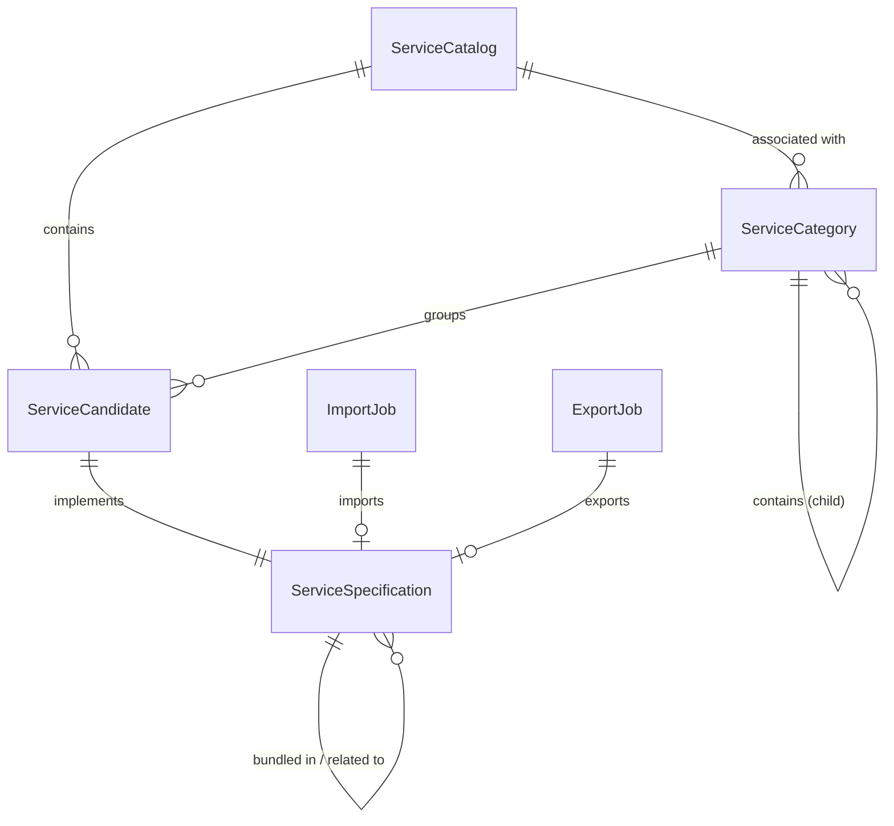

# 1. Introduction

## 1.1 Purpose
The Service Catalog Management system is a Java-based microservice designed to provide a standardized interface for the full lifecycle management of service catalog elements. It enables an organization to define, manage, and maintain its offerings of services in a telecom-aligned environment, ensuring interoperability through adherence to the TMF633 Open API specification.

## 1.2 Scope
### 1.2.1 In-Scope
The system SHALL provide the following capabilities:
- **Lifecycle Management**: Manage the creation, retrieval, update (via merge-patch and JSON Patch), and deletion of service catalogs, categories, candidates, and specifications.
- **Categorization**: Organize services into a hierarchical structure of service categories.
- **Candidate Management**: Track service specifications as candidates awaiting promotion to the active catalog.
- **Event-Driven Communication**: Publish and consume catalog-related events via Kafka for asynchronous system synchronization.
- **Data Portability**: Support asynchronous import and export of catalog data through dedicated job management.
- **Multi-Tenancy**: Ensure data isolation and access control based on tenant and organization identifiers.
- **Versioning**: Maintain a history of resource revisions to allow retrieval of specific versions.

### 1.2.2 Out-of-Scope
- **Frontend Interface**: The system is a backend-only API; it does NOT provide a user interface.
- **Direct Resource Provisioning**: The system manages the *specifications* of services, not the actual provisioning or instantiation of those services.
- **External Identity Management**: While it integrates with Keycloak, it does NOT manage the identity store itself.

## 1.3 Definitions, Acronyms, and Abbreviations
| Term | Definition |
| :--- | :--- |
| **TMF633** | TeleManagement Forum API for Service Catalog Management. |
| **SC** | Service Catalog. |
| **DTO** | Data Transfer Object; an object that carries data between processes. |
| **JSON Patch** | A format for describing changes to a JSON document (RFC 6902). |
| **Merge-Patch** | A method for partially updating a resource by merging a JSON document (RFC 7396). |
| **IAM** | Identity and Access Management. |
| **Lifecycle Management** | The process of managing an entity from its initial definition through modification to retirement. |

## 1.4 References
- **TMF633 Open API Specification**: `TMF633-Service-Catalog-v4.0.0-swagger.json`
- **RFC 2119**: Key words for use in RFCs to Indicate Requirement Levels.
- **RFC 6902**: JSON Patch.
- **RFC 7396**: JSON Merge Patch.

# 2. Assumptions and Constraints

## 2.1 Configuration Defaults
The system SHALL use the following default configuration settings as defined in `application.yml`:

| Parameter | Default Value | Purpose |
| :--- | :--- | :--- |
| `SERVER_PORT` | `8083` | The port on which the server listens. |
| `SERVER_SERVLET_CONTEXT_PATH` | `/api/serviceCatalogManagement/v4/` | Base URI path for the API. |
| `SPRING_DATA_MONGODB_INET_ADDRESS` | `mongodb://mongodb:27017` | Connection URI for MongoDB. |
| `SPRING_DATA_MONGODB_DATABASE` | `service_catalog` | Name of the MongoDB database. |
| `SPRING_KAFKA_BOOTSTRAP_SERVERS` | `http://kafka:9092` | Kafka cluster bootstrap servers. |
| `APPLICATION_MAX_RECORD_LIMIT` | `100` | Maximum number of records returned in list operations. |
| `APPLICATION_SCHEMA_VALIDATION_ENABLED` | `true` | Whether to enable schema validation for requests. |
| `APPLICATION_TENANCY_ENABLED` | `false` | Whether multi-tenancy is enabled. |
| `APPLICATION_ORGANIZATION_FILTER_ENABLED` | `false` | Whether organization-based filtering is enabled. |
| `SECURITY_ENABLED` | `true` | Whether security and token validation are enabled. |
| `configured-value.refresh` | `3600000` ms | Refresh interval for dynamic configuration settings. |

## 2.2 System Constraints
The system MUST adhere to the following technical constraints:
- **Runtime Environment**: The system MUST run on a Java Virtual Machine (JVM) as it is a Spring Boot application.
- **Database**: The system MUST utilize MongoDB for data persistence.
- **Messaging**: The system MUST utilize Apache Kafka for event-driven communication (CREATE, DELETE, CHANGE, STATE, LIST, RETRIEVE events).
- **Authentication**: The system MUST integrate with an OIDC-compliant identity provider (e.g., Keycloak) for token validation via JWK sets.
- **API Versioning**: The system MUST expose APIs under the `/v4/` context path.
- **Resource Limits**: The system SHOULD limit the maximum HTTP request header size to `102400` bytes.

## 2.3 Assumptions
The following assumptions are made regarding the software environment and inputs:
- **Infrastructure**: It is assumed that MongoDB and Kafka clusters are available and reachable at the configured addresses.
- **Identity Management**: It is assumed that a valid Keycloak realm and client (`orbitant-backend-client`) are configured for S2S and user authentication.
- **Input Validation**: The system assumes that incoming requests follow the TMF633 Service Catalog specifications (v4.0.0) as defined in the accompanying Swagger documentation.
- **Dynamic Config**: The system assumes the availability of a dynamic configuration service (`dnext-dcfms-configuration-mgmt-srvc`) when `CONFIGURED_VALUE_ENABLED` is set to `true`.
- **External IDs**: The system assumes that if `generateIdUrl` is provided for entities, the external ID generation service is operational.

# 3. System Context

## 3.1 External Interfaces

The Service Catalog Management system interacts with the following external systems:

### 3.1.1 Database System
- **MongoDB**: The primary persistence store for all service catalog entities. The system SHALL use MongoDB to store and retrieve service catalogs, categories, candidates, and specifications.

### 3.1.2 Messaging System
- **Apache Kafka**: Used for asynchronous event-driven communication. The system MUST publish events (Create, Delete, Change, State, List, Retrieve) to Kafka topics to notify other system components of state changes.

### 3.1.3 Identity and Access Management (IAM)
- **Keycloak**: Used for authentication and authorization. The system SHALL validate JWT tokens against Keycloak and use it for Service-to-Service (S2S) authentication.

### 3.1.4 External Management Services
- **Roles and Permissions Management Service**: Used for fine-grained access control (RBAC/ABAC). The system SHOULD interact with this service to verify user permissions via the `ACCESS_CONTROL_API_URL`.
- **Configuration Management Service**: Used to retrieve configured values for lifecycle statuses and job state types.
- **Href Map Management Service**: Used to resolve and map full HREFs for entities.

### 3.1.5 Process Orchestration
- **Camunda**: Integrated for business process orchestration of service catalog workflows.

## 3.2 Dependency Mapping

| Internal Component | External Dependency | Purpose |
| :--- | :--- | :--- |
| Repository Layer | MongoDB | Data persistence and retrieval |
| Event Layer | Apache Kafka | Publishing system events |
| Security Config | Keycloak | Token validation and IAM |
| Access Control | Roles and Permissions Mgmt Srvc | Permission verification |
| Config/Util | Configuration Mgmt Srvc | Dynamic value resolution |
| Config/Util | Href Map Mgmt Srvc | HREF mapping |

## 3.3 Data Flow

### 3.3.1 Inbound Data Flow (Client $\rightarrow$ System)
1. **Authentication**: Client provides a JWT token from Keycloak.
2. **Request**: Client sends a REST request (e.g., `POST /serviceCatalog`).
3. **Authorization**: The system verifies the token and queries the Roles and Permissions Management Service for access rights.
4. **Processing**: Business logic is executed in the Service Layer.

### 3.3.2 Outbound Data Flow (System $\rightarrow$ External)
1. **Persistence**: The system writes/updates entities in MongoDB via the Repository Layer.
2. **Notification**: After a state change, the Event Layer publishes a JSON payload to the corresponding Kafka topic (e.g., `SC_CREATE_EVENT`).
3. **External Lookup**: The system may request configuration values from the Configuration Management Service or HREF mappings from the Href Map Management Service.

# 4. Use Cases

This section describes the functional use cases of the Service Catalog Management system.

## 4.1 Use Case Diagram Summary
The system primarily interacts with a **Catalog Administrator** (Actor) who manages the lifecycle of service categories, specifications, candidates, and the overall catalog, as well as managing data import/export jobs and event subscriptions.

## 4.2 Detailed Use Cases

### UC-001: Manage Service Catalog
**Actor(s)**: Catalog Administrator
**Pre-conditions**: User is authenticated and authorized to manage the Service Catalog.

**Scenario 1: Create Service Catalog**
1. The Actor sends a POST request to create a Service Catalog entity.
2. The system SHALL validate the request payload against the `ServiceCatalog` schema.
3. The system SHALL perform tenancy and organization validation.
4. The system SHALL persist the new catalog to the database.
5. The system SHALL return the created `ServiceCatalog` entity.

**Scenario 2: Retrieve Service Catalog**
1. The Actor sends a GET request for a specific `id` (and optional `version`) or a list of catalog entities.
2. The system SHALL verify the requester's access to the catalog.
3. The system SHALL retrieve the requested entity or paginated list from the database.
4. The system SHALL return the `ServiceCatalog` entity or list.

**Scenario 3: Update Service Catalog**
1. The Actor sends a PATCH request with a `version` and update payload (Merge Patch or JSON Patch).
2. The system SHALL validate the update payload and verify the current version for optimistic locking.
3. The system SHALL perform tenancy validation.
4. The system SHALL persist the updates.
5. The system SHALL return the updated `ServiceCatalog` entity.

**Scenario 4: Delete Service Catalog**
1. The Actor sends a DELETE request for a specific `id` and `version`.
2. The system SHALL verify the requester's authorization to delete the entity.
3. The system SHALL remove the entity from the database.
4. The system SHALL return a success confirmation.

**Post-conditions**: The Service Catalog entity is created, retrieved, updated, or removed.
**Alternative/Exception Flows**:
- **Invalid Input**: If validation fails, the system MUST return a 400 Bad Request.
- **Resource Not Found**: If the requested ID does not exist, the system MUST return a 404 Not Found.
- **Concurrency Conflict**: If the provided version does not match the current state, the system MUST return a 409 Conflict.

### UC-002: Manage Service Specification
**Actor(s)**: Catalog Administrator
**Pre-conditions**: User is authenticated and authorized.

**Scenario 1: Create Service Specification**
1. The Actor sends a POST request to create a Service Specification.
2. The system SHALL validate the `ServiceSpecification` data, including relationships and characteristics.
3. The system SHALL ensure that referenced entities (e.g., category) exist and are in a valid state.
4. The system SHALL persist the specification.
5. The system SHALL return the created `ServiceSpecification` entity.

**Scenario 2: Retrieve Service Specification**
1. The Actor sends a GET request for a specific `id` (and optional `version`) or a list of specifications.
2. The system SHALL verify the requester's access to the specification.
3. The system SHALL retrieve the data from the database.
4. The system SHALL return the `ServiceSpecification` entity or list.

**Scenario 3: Update Service Specification**
1. The Actor sends a PATCH request with a `version` and update payload.
2. The system SHALL validate the update payload and referenced entities.
3. The system SHALL verify the current version for optimistic locking.
4. The system SHALL persist the updates.
5. The system SHALL return the updated `ServiceSpecification` entity.

**Scenario 4: Delete Service Specification**
1. The Actor sends a DELETE request for a specific `id` and `version`.
2. The system SHALL verify authorization.
3. The system SHALL remove the specification from the database.
4. The system SHALL return a success confirmation.

**Post-conditions**: The Service Specification is managed in the catalog.
**Alternative/Exception Flows**:
- **Reference Invalid**: If a referenced entity is invalid, the system MUST return a 400 Bad Request.
- **Unauthorized**: If the user lacks permissions, the system MUST return a 403 Forbidden.

### UC-003: Manage Service Category
**Actor(s)**: Catalog Administrator
**Pre-conditions**: User is authenticated and authorized.

**Scenario 1: Create Service Category**
1. The Actor sends a POST request to create a Service Category.
2. The system SHALL validate the category hierarchy (parent/child relationships).
3. The system SHALL validate the `ServiceCategory` schema.
4. The system SHALL persist the category.
5. The system SHALL return the created `ServiceCategory` entity.

**Scenario 2: Retrieve Service Category**
1. The Actor sends a GET request for a specific `id` (and optional `version`) or a list of categories.
2. The system SHALL verify the requester's access.
3. The system SHALL retrieve the data from the database.
4. The system SHALL return the `ServiceCategory` entity or list.

**Scenario 3: Update Service Category**
1. The Actor sends a PATCH request with a `version` and update payload.
2. The system SHALL validate the hierarchy to prevent circular dependencies.
3. The system SHALL verify the current version for optimistic locking.
4. The system SHALL persist the updates.
5. The system SHALL return the updated `ServiceCategory` entity.

**Scenario 4: Delete Service Category**
1. The Actor sends a DELETE request for a specific `id` and `version`.
2. The system SHALL verify authorization.
3. The system SHALL remove the category from the database.
4. The system SHALL return a success confirmation.

**Post-conditions**: The category structure is updated.
**Alternative/Exception Flows**:
- **Circular Dependency**: If a category is assigned as its own parent, the system MUST return a 400 Bad Request.

### UC-004: Manage Service Candidate
**Actor(s)**: Catalog Administrator
**Pre-conditions**: User is authenticated and authorized.

**Scenario 1: Create Service Candidate**
1. The Actor sends a POST request to create a Service Candidate.
2. The system SHALL verify the candidate's relationship to a Service Specification.
3. The system SHALL validate the `ServiceCandidate` entity.
4. The system SHALL persist the candidate.
5. The system SHALL return the created `ServiceCandidate` entity.

**Scenario 2: Retrieve Service Candidate**
1. The Actor sends a GET request for a specific `id` (and optional `version`) or a list of candidates.
2. The system SHALL verify the requester's access.
3. The system SHALL retrieve the data from the database.
4. The system SHALL return the `ServiceCandidate` entity or list.

**Scenario 3: Update Service Candidate**
1. The Actor sends a PATCH request with a `version` and update payload.
2. The system SHALL verify the linked Service Specification exists.
3. The system SHALL verify the current version for optimistic locking.
4. The system SHALL persist the updates.
5. The system SHALL return the updated `ServiceCandidate` entity.

**Scenario 4: Delete Service Candidate**
1. The Actor sends a DELETE request for a specific `id` and `version`.
2. The system SHALL verify authorization.
3. The system SHALL remove the candidate from the database.
4. The system SHALL return a success confirmation.

**Post-conditions**: The service candidate is registered or modified.
**Alternative/Exception Flows**:
- **Specification Missing**: If the linked Service Specification does not exist, the system MUST return a 400 Bad Request.

### UC-005: Execute Import Job
**Actor(s)**: Catalog Administrator
**Pre-conditions**: User is authenticated and authorized.
**Main Success Scenario**:
1. The Actor submits an `ImportJobCreate` request.
2. The system SHALL create an `ImportJob` record with an initial status (e.g., "Pending").
3. The system SHALL trigger the import process asynchronously.
4. The system SHALL return the `ImportJob` entity with its ID for tracking.
**Post-conditions**: An import process is initiated to populate the catalog.
**Alternative/Exception Flows**:
- **Malformed Job Request**: The system MUST return a 400 Bad Request if the job parameters are invalid.

### UC-006: Execute Export Job
**Actor(s)**: Catalog Administrator
**Pre-conditions**: User is authenticated and authorized.
**Main Success Scenario**:
1. The Actor submits an `ExportJobCreate` request.
2. The system SHALL create an `ExportJob` record.
3. The system SHALL initiate the extraction of catalog data.
4. The system SHALL return the `ExportJob` entity.
**Post-conditions**: An export process is initiated to extract catalog data.
**Alternative/Exception Flows**:
- **Export Failure**: If the export fails, the system SHOULD update the job status to "Failed" and provide an error message.

### UC-007: Manage Event Subscriptions
**Actor(s)**: External System / Catalog Administrator
**Pre-conditions**: User is authenticated.
**Main Success Scenario**:
1. The Actor sends a request to `/hub` to register a listener with a callback URL.
2. The system SHALL validate the `EventSubscriptionInput`.
3. The system SHALL store the subscription.
4. The system SHALL return an `EventSubscription` entity.
**Post-conditions**: The external system is registered to receive notifications for catalog changes.
**Alternative/Exception Flows**:
- **Invalid Callback URL**: The system MUST return a 400 Bad Request.

### UC-008: System Event Triggering
**Actor(s)**: System (Internal)
**Pre-conditions**: An entity (Service Catalog, Specification, Category, or Candidate) has been created, updated, deleted, or retrieved.
**Main Success Scenario**:
1. The system identifies a state change or retrieval event for a catalog entity.
2. The system SHALL construct a Kafka event payload matching the defined event schema.
3. The system SHALL publish the event to the corresponding Kafka topic.
4. The system SHALL ensure the event contains the necessary entity identifiers and change type.
**Post-conditions**: Event is published to Kafka, allowing external subscribers to react to catalog changes.
**Alternative/Exception Flows**:
- **Kafka Unavailable**: The system SHOULD log the failure and potentially retry the event publication.

# 5. Functional Requirements

All API endpoints listed in this section are relative to the base path: `/tmf-api/serviceCatalogManagement/v4/`

## 5.1 Service Catalog Management
The system SHALL provide the ability to manage the overall service catalog.

[FR-SC-001] The system SHALL create a new Service Catalog entity when a valid `ServiceCatalogCreate` request is received via POST `/serviceCatalog`.
[FR-SC-002] The system SHALL retrieve a specific version of a Service Catalog entity when a valid `id` and `version` are provided via GET `/serviceCatalog/{id}`.
[FR-SC-003] The system SHALL retrieve a paginated list of Service Catalog entities when a GET request is received at `/serviceCatalog` with optional filters.
[FR-SC-004] The system SHALL partially update a Service Catalog entity using merge-patch when a valid `id`, `version`, and `ServiceCatalogUpdate` DTO are provided via PATCH `/serviceCatalog/{id}`.
[FR-SC-005] The system SHALL partially update a Service Catalog entity using JSON Patch when a valid `id`, `version`, and `JsonPatch` object are provided via PATCH `/serviceCatalog/{id}`.
[FR-SC-006] The system SHALL delete a specific version of a Service Catalog entity when a valid `id` and `version` are provided via DELETE `/serviceCatalog/{id}`.

## 5.2 Service Specification Management
The system SHALL provide the ability to define and manage the lifecycle of service specifications.

[FR-SS-001] The system SHALL create a new Service Specification entity when a valid `ServiceSpecificationCreate` request is received via POST `/serviceSpecification`.
[FR-SS-002] The system SHALL retrieve a specific version of a Service Specification when a valid `id` and `version` are provided via GET `/serviceSpecification/{id}`.
[FR-SS-003] The system SHALL retrieve a paginated list of Service Specifications when a GET request is received at `/serviceSpecification` with optional filters.
[FR-SS-004] The system SHALL partially update a Service Specification using merge-patch when a valid `id`, `version`, and `ServiceSpecificationUpdate` DTO are provided via PATCH `/serviceSpecification/{id}`.
[FR-SS-005] The system SHALL partially update a Service Specification using JSON Patch when a valid `id`, `version`, and `JsonPatch` object are provided via PATCH `/serviceSpecification/{id}`.
[FR-SS-006] The system SHALL delete a specific version of a Service Specification when a valid `id` and `version` are provided via DELETE `/serviceSpecification/{id}`.
[FR-SS-007] The system SHALL validate that `validFor` start and end dates are logically consistent before persisting a Service Specification.

## 5.3 Service Category Management
The system SHALL provide the ability to categorize services within the catalog.

[FR-SCT-001] The system SHALL create a new Service Category entity when a valid `ServiceCategoryCreate` request is received via POST `/serviceCategory`.
[FR-SCT-002] The system SHALL retrieve a specific version of a Service Category when a valid `id` and `version` are provided via GET `/serviceCategory/{id}`.
[FR-SCT-003] The system SHALL retrieve a paginated list of Service Categories when a GET request is received at `/serviceCategory` with optional filters.
[FR-SCT-004] The system SHALL partially update a Service Category using merge-patch when a valid `id`, `version`, and `ServiceCategoryUpdate` DTO are provided via PATCH `/serviceCategory/{id}`.
[FR-SCT-005] The system SHALL partially update a Service Category using JSON Patch when a valid `id`, `version`, and `JsonPatch` object are provided via PATCH `/serviceCategory/{id}`.
[FR-SCT-006] The system SHALL delete a specific version of a Service Category when a valid `id` and `version` are provided via DELETE `/serviceCategory/{id}`.

## 5.4 Service Candidate Management
The system SHALL manage service candidates awaiting promotion to the catalog.

[FR-SCD-001] The system SHALL create a new Service Candidate entity when a valid `ServiceCandidateCreate` request is received via POST `/serviceCandidate`.
[FR-SCD-002] The system SHALL retrieve a specific version of a Service Candidate when a valid `id` and `version` are provided via GET `/serviceCandidate/{id}`.
[FR-SCD-003] The system SHALL retrieve a paginated list of Service Candidates when a GET request is received at `/serviceCandidate` with optional filters.
[FR-SCD-004] The system SHALL partially update a Service Candidate using merge-patch when a valid `id`, `version`, and `ServiceCandidateUpdate` DTO are provided via PATCH `/serviceCandidate/{id}`.
[FR-SCD-005] The system SHALL partially update a Service Candidate using JSON Patch when a valid `id`, `version`, and `JsonPatch` object are provided via PATCH `/serviceCandidate/{id}`.
[FR-SCD-006] The system SHALL delete a specific version of a Service Candidate when a valid `id` and `version` are provided via DELETE `/serviceCandidate/{id}`.

## 5.5 Data Import and Export Jobs
The system SHALL provide asynchronous capabilities for bulk data migration.

[FR-JOB-001] The system SHALL initiate a data import job when a valid `ImportJobCreate` request is received via POST `/importJob`.
[FR-JOB-002] The system SHALL initiate a data export job when a valid `ExportJobCreate` request is received via POST `/exportJob`.
[FR-JOB-003] The system SHALL track the status (e.g., Not Started, Running, Succeeded, Failed) of import and export jobs.
[FR-JOB-004] The system SHALL retrieve the details of a specific import job when a valid `id` is provided via GET `/importJob/{id}`.
[FR-JOB-005] The system SHALL retrieve the details of a specific export job when a valid `id` is provided via GET `/exportJob/{id}`.
[FR-JOB-006] The system SHALL retrieve a paginated list of import jobs when a GET request is received at `/importJob`.
[FR-JOB-007] The system SHALL retrieve a paginated list of export jobs when a GET request is received at `/exportJob`.
[FR-JOB-008] The system SHALL allow deletion of import and export jobs via their respective DELETE endpoints.

## 5.6 Event Management (Hub)
The system SHALL support event-driven notifications for catalog changes.

[FR-EVT-001] The system SHALL register a listener for event notifications when a valid `EventSubscriptionInput` is received via POST `/hub`.
[FR-EVT-002] The system SHALL unregister a listener when a valid `id` is provided via DELETE `/hub/{id}`.
[FR-EVT-003] The system SHALL publish a Kafka event when a Service Catalog, Service Specification, Service Category, or Service Candidate is created.
[FR-EVT-004] The system SHALL publish a Kafka event when a Service Catalog, Service Specification, Service Category, or Service Candidate is updated.
[FR-EVT-005] The system SHALL publish a Kafka event when a Service Catalog, Service Specification, Service Category, or Service Candidate is deleted.
[FR-EVT-006] The system SHALL publish a Kafka event when a Service Catalog, Service Specification, Service Category, or Service Candidate is retrieved or listed.

## 5.7 Cross-Cutting Functional Requirements

### 5.7.1 Security and Authorization
[FR-SEC-001] The system SHALL verify administrative tenancy via the `AccessPolicyService` before creating any catalog entity.
[FR-SEC-002] The system SHALL validate that the requester has access to a specific entity via `validateTenancy` during retrieval operations.
[FR-SEC-003] The system SHALL bind every created entity to an access policy constraint.

### 5.7.2 Data Versioning
[FR-VER-001] The system SHALL maintain multiple versions of entities and allow retrieval of a specific version via the `version` query parameter.
[FR-VER-002] The system SHALL implement optimistic locking using a `revision` field to prevent concurrent update conflicts.

### 5.7.3 Validation
[FR-VAL-001] The system SHALL validate incoming request DTOs using JSR-303 annotations.
[FR-VAL-002] The system SHALL execute custom business validation rules (defined in `com.pia.orbitant.servicecatalog.validator`) before persisting any entity.

# Section 6: Interfaces

This section describes the external interfaces of the Service Catalog Management system, specifically the REST API endpoints used to manage the service catalog, categories, candidates, and specifications.

## 6.1 API General Specifications
All API endpoints SHALL use HTTPS for secure communication.
The request and response format MUST be `application/json;charset=utf-8`.
The base path for all endpoints is `/tmf-api/serviceCatalogManagement/v4/`.

## 6.2 Interface Definitions

### 6.2.1 Service Catalog Interfaces

#### List Service Catalogs
- **Endpoint:** `GET /serviceCatalog`
- **Description:** List or find ServiceCatalog entities.
- **Request Parameters:**
    - `fields` (string, optional): Comma-separated properties to be provided in response.
    - `offset` (integer, optional): Requested index for start of resources.
    - `limit` (integer, optional): Requested number of resources.
- **Response:**
    - **Status 200:** Success. Returns an array of `ServiceCatalog` objects.
    - **Headers:** `X-Result-Count` (Actual number of items), `X-Total-Count` (Total matching items).
- **Error Responses:** 400 (Bad Request), 401 (Unauthorized), 403 (Forbidden), 404 (Not Found), 405 (Method Not Allowed), 409 (Conflict), 500 (Internal Server Error).

#### Create Service Catalog
- **Endpoint:** `POST /serviceCatalog`
- **Description:** Creates a ServiceCatalog entity.
- **Request Body:** `ServiceCatalog_Create` (mandatory).
- **Response:**
    - **Status 201:** Created. Returns the created `ServiceCatalog` object.
- **Error Responses:** 400, 401, 403, 405, 409, 500.

#### Retrieve Service Catalog
- **Endpoint:** `GET /serviceCatalog/{id}`
- **Description:** Retrieves a ServiceCatalog entity by its identifier.
- **Request Parameters:**
    - `id` (string, mandatory, path): Identifier of the ServiceCatalog.
    - `fields` (string, optional, query): Comma-separated properties for response.
- **Response:**
    - **Status 200:** Success. Returns a `ServiceCatalog` object.
- **Error Responses:** 400, 401, 403, 404, 405, 409, 500.

#### Update Service Catalog
- **Endpoint:** `PATCH /serviceCatalog/{id}`
- **Description:** Partially updates a ServiceCatalog entity.
- **Request Parameters:**
    - `id` (string, mandatory, path): Identifier of the ServiceCatalog.
- **Request Body:** `ServiceCatalog_Update` (mandatory).
- **Response:**
    - **Status 200:** Updated. Returns the updated `ServiceCatalog` object.
- **Error Responses:** 400, 401, 403, 404, 405, 409, 500.

#### Delete Service Catalog
- **Endpoint:** `DELETE /serviceCatalog/{id}`
- **Description:** Deletes a ServiceCatalog entity.
- **Request Parameters:**
    - `id` (string, mandatory, path): Identifier of the ServiceCatalog.
- **Response:**
    - **Status 204:** Deleted.
- **Error Responses:** 400, 401, 403, 404, 405, 409, 500.

### 6.2.2 Service Category Interfaces

#### List Service Categories
- **Endpoint:** `GET /serviceCategory`
- **Description:** List or find ServiceCategory entities.
- **Request Parameters:** `fields`, `offset`, `limit` (all optional).
- **Response:**
    - **Status 200:** Success. Returns an array of `ServiceCategory` objects.
- **Error Responses:** 400, 401, 403, 404, 405, 409, 500.

#### Create Service Category
- **Endpoint:** `POST /serviceCategory`
- **Description:** Creates a ServiceCategory entity.
- **Request Body:** `ServiceCategory_Create` (mandatory).
- **Response:**
    - **Status 201:** Created. Returns the created `ServiceCategory` object.
- **Error Responses:** 400, 401, 403, 405, 409, 500.

#### Retrieve Service Category
- **Endpoint:** `GET /serviceCategory/{id}`
- **Description:** Retrieves a ServiceCategory entity by ID.
- **Request Parameters:** `id` (mandatory, path), `fields` (optional, query).
- **Response:**
    - **Status 200:** Success. Returns a `ServiceCategory` object.
- **Error Responses:** 400, 401, 403, 404, 405, 409, 500.

#### Update Service Category
- **Endpoint:** `PATCH /serviceCategory/{id}`
- **Description:** Partially updates a ServiceCategory entity.
- **Request Parameters:** `id` (mandatory, path).
- **Request Body:** `ServiceCategory_Update` (mandatory).
- **Response:**
    - **Status 200:** Updated. Returns the updated `ServiceCategory` object.
- **Error Responses:** 400, 401, 403, 404, 405, 409, 500.

#### Delete Service Category
- **Endpoint:** `DELETE /serviceCategory/{id}`
- **Description:** Deletes a ServiceCategory entity.
- **Request Parameters:** `id` (mandatory, path).
- **Response:**
    - **Status 204:** Deleted.
- **Error Responses:** 400, 401, 403, 404, 405, 409, 500.

### 6.2.3 Service Candidate Interfaces

#### List Service Candidates
- **Endpoint:** `GET /serviceCandidate`
- **Description:** List or find ServiceCandidate entities.
- **Request Parameters:** `fields`, `offset`, `limit` (all optional).
- **Response:**
    - **Status 200:** Success. Returns an array of `ServiceCandidate` objects.
- **Error Responses:** 400, 401, 403, 404, 405, 409, 500.

#### Create Service Candidate
- **Endpoint:** `POST /serviceCandidate`
- **Description:** Creates a ServiceCandidate entity.
- **Request Body:** `ServiceCandidate_Create` (mandatory).
- **Response:**
    - **Status 201:** Created. Returns the created `ServiceCandidate` object.
- **Error Responses:** 400, 401, 403, 405, 409, 500.

#### Retrieve Service Candidate
- **Endpoint:** `GET /serviceCandidate/{id}`
- **Description:** Retrieves a ServiceCandidate entity by ID.
- **Request Parameters:** `id` (mandatory, path), `fields` (optional, query).
- **Response:**
    - **Status 200:** Success. Returns a `ServiceCandidate` object.
- **Error Responses:** 400, 401, 403, 404, 405, 409, 500.

#### Update Service Candidate
- **Endpoint:** `PATCH /serviceCandidate/{id}`
- **Description:** Partially updates a ServiceCandidate entity.
- **Request Parameters:** `id` (mandatory, path).
- **Request Body:** `ServiceCandidate_Update` (mandatory).
- **Response:**
    - **Status 200:** Updated. Returns the updated `ServiceCandidate` object.
- **Error Responses:** 400, 401, 403, 404, 405, 409, 500.

#### Delete Service Candidate
- **Endpoint:** `DELETE /serviceCandidate/{id}`
- **Description:** Deletes a ServiceCandidate entity.
- **Request Parameters:** `id` (mandatory, path).
- **Response:**
    - **Status 204:** Deleted.
- **Error Responses:** 400, 401, 403, 404, 405, 409, 500.

### 6.2.4 Service Specification Interfaces

#### List Service Specifications
- **Endpoint:** `GET /serviceSpecification`
- **Description:** List or find ServiceSpecification entities.
- **Request Parameters:** `fields`, `offset`, `limit` (all optional).
- **Response:**
    - **Status 200:** Success. Returns an array of `ServiceSpecification` objects.
- **Error Responses:** 400, 401, 403, 404, 405, 409, 500.

#### Create Service Specification
- **Endpoint:** `POST /serviceSpecification`
- **Description:** Creates a ServiceSpecification entity.
- **Request Body:** `ServiceSpecification_Create` (mandatory).
- **Response:**
    - **Status 201:** Created. Returns the created `ServiceSpecification` object.
- **Error Responses:** 400, 401, 403, 405, 409, 500.

#### Retrieve Service Specification
- **Endpoint:** `GET /serviceSpecification/{id}`
- **Description:** Retrieves a ServiceSpecification entity by ID.
- **Request Parameters:** `id` (mandatory, path), `fields` (optional, query).
- **Response:**
    - **Status 200:** Success. Returns a `ServiceSpecification` object.
- **Error Responses:** 400, 401, 403, 404, 405, 409, 500.

#### Update Service Specification
- **Endpoint:** `PATCH /serviceSpecification/{id}`
- **Description:** Partially updates a ServiceSpecification entity.
- **Request Parameters:** `id` (mandatory, path).
- **Request Body:** `ServiceSpecification_Update` (mandatory).
- **Response:**
    - **Status 200:** Updated. Returns the updated `ServiceSpecification` object.
- **Error Responses:** 400, 401, 403, 404, 405, 409, 500.

#### Delete Service Specification
- **Endpoint:** `DELETE /serviceSpecification/{id}`
- **Description:** Deletes a ServiceSpecification entity.
- **Request Parameters:** `id` (mandatory, path).
- **Response:**
    - **Status 204:** Deleted.
- **Error Responses:** 400, 401, 403, 404, 405, 409, 500.

### 6.2.5 Job Management Interfaces

#### Import Job Management
- **GET `/importJob`**: List ImportJob entities.
- **POST `/importJob`**: Create an ImportJob using `ImportJob_Create` body.
- **GET `/importJob/{id}`**: Retrieve ImportJob by ID.
- **DELETE `/importJob/{id}`**: Delete ImportJob by ID.

#### Export Job Management
- **GET `/exportJob`**: List ExportJob entities.
- **POST `/exportJob`**: Create an ExportJob using `ExportJob_Create` body.
- **GET `/exportJob/{id}`**: Retrieve ExportJob by ID.
- **DELETE `/exportJob/{id}`**: Delete ExportJob by ID.

### 6.2.6 Event Subscription Interfaces

#### Register Listener
- **Endpoint:** `POST /hub`
- **Description:** Sets the communication endpoint address for event delivery.
- **Request Body:** `EventSubscriptionInput` (mandatory).
- **Response:**
    - **Status 201:** Subscribed. Returns an `EventSubscription` object.
- **Error Responses:** 400, 401, 403, 404, 405, 409, 500.

#### Unregister Listener
- **Endpoint:** `DELETE /hub/{id}`
- **Description:** Resets the communication endpoint address.
- **Request Parameters:** `id` (mandatory, path).
- **Response:**
    - **Status 204:** Deleted.
- **Error Responses:** 400, 401, 403, 404, 405, 500.

## 6.3 Error Response Meanings
All error responses SHALL contain an `Error` object.
- **400 Bad Request:** The request was invalid or cannot be served.
- **401 Unauthorized:** Authentication is required or has failed.
- **403 Forbidden:** The user does not have permission to access the resource.
- **404 Not Found:** The requested resource could not be found.
- **405 Method Not Allowed:** The HTTP method is not supported for this endpoint.
- **409 Conflict:** The request conflicts with the current state of the server.
- **500 Internal Server Error:** An unexpected error occurred on the server.

# 7. Data Model Summary

This section provides a detailed summary of the data model used in the Service Catalog system. The system utilizes a NoSQL approach with MongoDB, employing a layered inheritance model to ensure consistency across business entities.

## 7.1 Entity Relationship Diagram

## 7.2 Primary Entities

### 7.2.1 ServiceCatalog
**Description:** Represents a collection of services organized by categories.
- **Primary Key:** `id` (String)
- **Attributes:**
    - `category` (List\<ServiceCategoryRef\>): List of associated service categories.
    - `relatedParty` (List\<RelatedParty\>): Parties or roles related to this catalog.
    - `catalogType` (String): Identifier of the type of catalog.
- **Relationships:**
    - 1:N with `ServiceCategory`
    - 1:N with `ServiceCandidate`

### 7.2.2 ServiceCategory
**Description:** Provides a hierarchical grouping mechanism for service candidates.
- **Primary Key:** `id` (String)
- **Attributes:**
    - `isRoot` (Boolean): Indicates if this is a root category.
    - `parentId` (String): Unique identifier of the parent category.
    - `parent` (ServiceCategoryRef): Reference to the parent category.
    - `category` (List\<ServiceCategoryRef\>): List of child categories.
    - `serviceCandidate` (List\<ServiceCandidateRef\>): List of associated service candidates.
- **Relationships:**
    - 1:N with `ServiceCategory` (Self-relationship for hierarchy)
    - 1:N with `ServiceCandidate`
    - N:1 with `ServiceCatalog`

### 7.2.3 ServiceCandidate
**Description:** A candidate service that implements a specific service specification.
- **Primary Key:** `id` (String)
- **Attributes:**
    - `category` (List\<ServiceCategoryRef\>): List of categories for this candidate.
    - `serviceSpecification` (ServiceSpecificationRef): The specification implied by this candidate.
- **Relationships:**
    - 1:1 with `ServiceSpecification`
    - N:M with `ServiceCategory`
    - N:1 with `ServiceCatalog`

### 7.2.4 ServiceSpecification
**Description:** Defines the technical and business characteristics of a service.
- **Primary Key:** `id` (String)
- **Attributes:**
    - `isBundle` (Boolean): Whether it represents a bundle of specifications.
    - `attachment` (List\<AttachmentRefOrValue\>): Relevant attachments.
    - `constraint` (List\<ConstraintRef\>): Applied constraint references.
    - `bundledServiceSpecification` (List\<BundledServiceSpecification\>): Grouping of service specifications.
    - `entitySpecRelationship` (List\<EntitySpecificationRelationship\>): Relationship to another specification.
    - `featureSpecification` (List\<FeatureSpecification\>): List of features for this specification.
    - `relatedParty` (List\<RelatedParty\>): Parties managing the specification.
    - `resourceSpecification` (List\<ResourceSpecificationRef\>): Resource specifications.
    - `serviceLevelSpecification` (List\<ServiceLevelSpecificationRef\>): Related service level specifications.
    - `serviceSpecRelationship` (List\<ServiceSpecRelationship\>): Related specifications.
    - `specCharacteristic` (List\<CharacteristicSpecification\>): Characteristics the entity can take.
    - `targetEntitySchema` (TargetEntitySchema): Pointer to target entity schema.
    - `pExtension` (ServiceSpecificationExtension): Extended model attributes.
- **Relationships:**
    - 1:N with `ServiceSpecification` (Self-relationship for bundling/relating)
    - 1:1 with `ServiceCandidate`

### 7.2.5 ImportJob
**Description:** Tracks the status and metadata of data import operations.
- **Primary Key:** `id` (String)
- **Attributes:**
    - `href` (String): Reference of the import job.
    - `completionDate` (OffsetDateTime): Date at which the job was completed.
    - `contentType` (String): Format of the imported data.
    - `creationDate` (OffsetDateTime): Date at which the job was created.
    - `errorLog` (String): Reason for failure if status is failed.
    - `path` (String): URL of the root resource for application.
    - `url` (String): URL of the file containing data.
    - `status` (String): Job status (not started, running, succeeded, failed).
- **Relationships:**
    - 1:1 (Optional) with `ServiceSpecification`

### 7.2.6 ExportJob
**Description:** Tracks the status and metadata of data export operations.
- **Primary Key:** `id` (String)
- **Attributes:**
    - `href` (String): Reference of the export job.
    - `completionDate` (OffsetDateTime): Date at which the job was completed.
    - `contentType` (String): Format of the exported data.
    - `creationDate` (OffsetDateTime): Date at which the job was created.
    - `errorLog` (String): Reason for failure.
    - `path` (String): URL of root resource source.
    - `query` (String): Scoping for exported data.
    - `url` (String): URL of the file containing exported data.
    - `status` (String): Job status (not started, running, succeeded, failed).
- **Relationships:**
    - 1:1 (Optional) with `ServiceSpecification`

## 7.3 Data Model Requirements

### 7.3.1 General Constraints
- All business entities SHALL inherit from `TenantEntity` to ensure multi-tenancy isolation.
- All business entities MUST inherit from `TrackableBaseEntity` to provide audit fields (`createdDate`, `updatedDate`, `createdBy`, `updatedBy`) and optimistic locking via the `revision` field.
- The system SHALL use a unique identifier (`id`) as the Primary Key for all primary entities.

### 7.3.2 Validation Requirements
- The system MUST validate the `validFor` date range for `ServiceSpecification` to ensure the start date is before the end date.
- For POST operations on versioned entities, the system SHOULD validate that previous versions match to prevent data inconsistency.
- The system MUST verify the `LifecycleStatus` of an entity before allowing state-dependent operations (e.g., patching or deleting).

# Section 8: Validation Rules

This section specifies the validation rules that SHALL be applied to the inputs of the Service Catalog system to ensure data integrity, consistency, and adherence to business logic.

## 8.1 General Validation Principles
- All request-level validations MUST be performed before business logic execution.
- Validation failures SHALL result in a `400 Bad Request` response.
- RFC 2119 keywords are used: SHALL (required), MUST (mandatory), SHOULD (recommended).

## 8.2 Entity Validation Rules

### 8.2.1 Lifecycle Status (Cross-Entity)
The `lifecycleStatus` field is critical across all resources and MUST follow these rules:

| Field Name | Validation Rule | Error Message | Validation Level |
| :--- | :--- | :--- | :--- |
| `lifecycleStatus` | If version is 0, MUST be one of: `In study`, `In design`, `In test`. | "If version is 0 lifeCycleStatus should be one of => [In study, In design, In test]" | Request-level |
| `lifecycleStatus` | If version > 0, MUST be one of: `Active`, `Launched`. | "If version is greater than 0 lifeCycleStatus should be one of => [Active, Launched]" | Request-level |
| `lifecycleStatus` | During PATCH, MUST follow valid state transition paths (defined in `LifecycleStatus.getTransitionableStatuses`). | (Internal Transition Error) | Business-logic-level |
| `lifecycleStatus` | Entity MUST NOT be deletable if status is `Active`, `Launched`, or `Retired`. | (Deletable check failure) | Business-logic-level |

### 8.2.2 Service Candidate
| Field Name | Validation Rule | Error Message | Validation Level |
| :--- | :--- | :--- | :--- |
| `serviceSpecification` | If provided, the referenced specification MUST exist in the system. | "specification [ID] not found" | Business-logic-level |
| `category` | Referenced categories MUST exist; multiple entries with same ID and version SHALL NOT be allowed. | "Same id and version is used for category" / "category [ID] not found" | Business-logic-level |
| `name` | MUST be unique (case-insensitive) within the same resource type. | (Name uniqueness error) | Business-logic-level |

### 8.2.3 Service Category
| Field Name | Validation Rule | Error Message | Validation Level |
| :--- | :--- | :--- | :--- |
| `parent` | If provided, parent category MUST exist. | "category [ID] not found" | Business-logic-level |

### 8.2.4 Service Specification
| Field Name | Validation Rule | Error Message | Validation Level |
| :--- | :--- | :--- | :--- |
| `name` | MUST be unique (case-insensitive) within the same resource type. | (Name uniqueness error) | Business-logic-level |

## 8.3 Reference & Consistency Validations

### 8.3.1 Lifecycle Consistency (RefVerEntitiesLCStateValidator)
When an entity's `lifecycleStatus` is changed to `Active` or `Launched`, the system SHALL verify that all referenced entities (via `href`) also have an acceptable status:
- If entity is `Launched`, all referenced entities MUST be `Launched`.
- If entity is `Active`, all referenced entities MUST be `Active` or `Launched`.
- **Error Message:** "Cannot change ‘lifecycleStatus’ to [Status] Unacceptable lifecycleStatus value for entity/entities => [hrefs]"
- **Validation Level:** Business-logic-level.

### 8.3.2 Deletion Constraints
An entity SHALL NOT be deleted if it is currently referenced by other entities.
- For `Service Candidate`: System MUST check if it is used in any `Service Category`.
- **Error Message:** "Service Candidate is used in service category ids => [IDs]"
- **Validation Level:** Business-logic-level.

## 8.4 Security & Tenancy Validations
- **Tenancy:** Every request MUST be validated against the tenant context to ensure the user has access to the resource.
- **Ownership:** If ACL (Access Control List) is enabled, the system MUST ensure a valid owner (typically the current user) is associated with the entity upon creation.

# 9. Non-Functional Requirements

## 9.1 Performance
- **Response Time**: The system SHOULD aim for low-latency responses for standard REST API operations. Specifically, `okhttpConnectTimeout`, `okhttpReadTimeout`, and `okhttpWriteTimeout` SHALL be configured to 10 seconds to prevent hanging connections.
- **Throughput**: The system MUST support paginated listing of entities with a `maxRecordLimit` of 100 records per request to ensure stable memory usage and response times.
- **Scalability**: The system SHALL be deployed as a containerized microservice using Docker and Kubernetes, allowing for horizontal scaling of the API layer based on traffic demand.
- **Resource Utilization**: The system SHOULD adhere to the build-time resource allocations of 1750m CPU and 7Gi Memory as a baseline for performance tuning.

## 9.2 Security
- **Authentication**: The system MUST integrate with Keycloak for Identity and Access Management (IAM). All API requests (except whitelisted paths) SHALL be secured using Bearer tokens.
- **Authorization**: 
    - The system SHALL implement Role-Based Access Control (RBAC). Access to `/serviceCatalog`, `/serviceCategory`, `/serviceCandidate`, and `/serviceSpecification` endpoints MUST require the `service-catalog` role.
    - The system MUST support multi-tenancy and organization-based data partitioning, verified via `tenantId` and `organizationId` filters.
- **Encryption & Data Privacy**:
    - Database credentials MUST be protected; `SPRING_DATA_MONGODB_PASSWORD_PROTECTION_ENABLED` SHALL be set to `true`.
    - Sensitive data in logs (e.g., `Authorization` headers, `X-Secret`, `access_token`, `password`) MUST be obfuscated using the Logbook library.
- **Network Security**: The system MUST run as a non-privileged user (`javauser`) within the container to minimize the attack surface.

## 9.3 Availability & Reliability
- **Uptime**: The system SHOULD be deployed in a Kubernetes environment to leverage self-healing capabilities (restarts) and high availability.
- **Health Monitoring**: The system MUST expose health probes (`/actuator/health/liveness` and `/actuator/health/readiness`) to allow the orchestrator to monitor and manage instance availability.
- **Error Recovery**:
    - The system SHALL implement a retry mechanism for external service calls with a `retryMaxAttempt` of 3 and a `backoffDelay` of 1000ms.
    - The system MUST NOT retry requests that return status codes 401, 402, 302, or 404.
- **Data Consistency**: The system SHALL utilize MongoDB multi-document transactions for operations spanning multiple collections to ensure atomicity.

## 9.4 Maintainability & Portability
- **Coding Standards**: The system MUST be developed using Java 17 and Spring Boot 3.5.15, following the layered architecture pattern.
- **Dependency Management**: All dependencies MUST be managed via Maven 3.
- **Portability**: 
    - The system MUST be packaged as a Docker image based on `eclipse-temurin:17.0.9_9-jre-focal` to ensure consistency across development, test, and production environments.
    - The system SHOULD use environment variables for all environment-specific configurations (e.g., database URIs, Kafka bootstrap servers) to maintain portability.
- **Observability**: The system SHALL expose metrics via the Prometheus endpoint for monitoring and utilize structured logging (Logstash format) for centralized log analysis.

# 10. Verification of the Software Requirements Specification (SRS)

This section defines the verification criteria and test cases used to ensure that the functional requirements specified in Section 5 are correctly implemented. All verification activities SHALL follow the pass/fail criteria defined below.

## 10.1 Verification Matrix

| Req ID | Test Case ID | Input Data | Expected Result | Pass/Fail Criteria | Reference |
| :--- | :--- | :--- | :--- | :--- | :--- |
| [FR-SC-001] | TC-SC-001 | Valid `ServiceCatalogCreate` DTO via POST `/serviceCatalog` | HTTP 201 Created; Entity persisted with generated ID and version 0 | Status code is 201 and response body contains valid ID and href | `ServiceCatalogControllerTest` |
| [FR-SC-002] | TC-SC-002 | Valid `id` and `version` via GET `/serviceCatalog/{id}` | HTTP 200 OK; Correct version of the Service Catalog entity returned | Status code is 200 and returned entity matches requested version | `ServiceCatalogControllerTest` |
| [FR-SC-003] | TC-SC-003 | GET `/serviceCatalog` with `limit` and `offset` | HTTP 206 Partial Content (if pagination applied) or 200 OK; Paginated list returned | Status code 200/206 and result list size matches `limit` | `ServiceCatalogControllerTest` |
| [FR-SC-004] | TC-SC-004 | Valid `id`, `version`, and `ServiceCatalogUpdate` via PATCH `/serviceCatalog/{id}` | HTTP 200 OK; Entity updated and new version created | Status code 200 and patched fields are reflected in retrieved entity | `ServiceCatalogControllerTest` |
| [FR-SC-005] | TC-SC-005 | Valid `id`, `version`, and `JsonPatch` via PATCH `/serviceCatalog/{id}` | HTTP 200 OK; Entity updated according to JSON Patch operations | Status code 200 and specific patched values are correct | `ServiceCatalogControllerTest` |
| [FR-SC-006] | TC-SC-006 | Valid `id` and `version` via DELETE `/serviceCatalog/{id}` | HTTP 204 No Content; Entity version removed | Status code 204 and subsequent GET returns 404 | `ServiceCatalogControllerTest` |
| [FR-SS-001] | TC-SS-001 | Valid `ServiceSpecificationCreate` via POST `/serviceSpecification` | HTTP 201 Created; Entity persisted | Status code 201 and entity contains provided data | `ServiceSpecificationControllerTest:185` |
| [FR-SS-002] | TC-SS-002 | Valid `id` and `version` via GET `/serviceSpecification/{id}` | HTTP 200 OK; Correct specification version returned | Status code 200 and entity matches requested ID/version | `ServiceSpecificationControllerTest:123` |
| [FR-SS-003] | TC-SS-003 | GET `/serviceSpecification?offset=1&limit=1` | HTTP 206 Partial Content; Subset of specifications returned | Status code 206 and result count is 1 | `ServiceSpecificationControllerTest:640` |
| [FR-SS-004] | TC-SS-004 | Valid `id`, `version`, and `ServiceSpecificationUpdate` via PATCH `/serviceSpecification/{id}` | HTTP 200 OK; Specification updated | Status code 200 and updated fields (e.g. description) are correct | `ServiceSpecificationControllerTest:544` |
| [FR-SS-005] | TC-SS-005 | Valid `id`, `version`, and `JsonPatch` via PATCH `/serviceSpecification/{id}` | HTTP 200 OK; Specification updated | Status code 200 and patched fields (e.g. name) are correct | `ServiceSpecificationControllerTest:111` |
| [FR-SS-006] | TC-SS-006 | Valid `id` and `version` via DELETE `/serviceSpecification/{id}` | HTTP 204 No Content; Specification version removed | Status code 204 and entity is no longer retrievable | `ServiceSpecificationControllerTest:439` |
| [FR-SS-007] | TC-SS-007 | `ServiceSpecificationCreate` with illogical `validFor` dates | HTTP 422 Unprocessable Entity; Validation error returned | Status code 422 and error message mentions date consistency | `ServiceSpecificationControllerTest` |
| [FR-SCT-001] | TC-SCT-001 | Valid `ServiceCategoryCreate` via POST `/serviceCategory` | HTTP 201 Created; Category persisted | Status code 201 and response contains valid category data | `ServiceCategoryControllerTest` |
| [FR-SCT-002] | TC-SCT-002 | Valid `id` and `version` via GET `/serviceCategory/{id}` | HTTP 200 OK; Correct category version returned | Status code 200 and entity matches requested ID/version | `ServiceCategoryControllerTest` |
| [FR-SCT-003] | TC-SCT-003 | GET `/serviceCategory` with filters | HTTP 200 OK; Paginated list of categories returned | Status code 200 and list contains only entities matching filters | `ServiceCategoryControllerTest` |
| [FR-SCT-004] | TC-SCT-004 | Valid `id`, `version`, and `ServiceCategoryUpdate` via PATCH `/serviceCategory/{id}` | HTTP 200 OK; Category updated | Status code 200 and updates are persisted | `ServiceCategoryControllerTest` |
| [FR-SCT-005] | TC-SCT-005 | Valid `id`, `version`, and `JsonPatch` via PATCH `/serviceCategory/{id}` | HTTP 200 OK; Category updated | Status code 200 and JSON Patch operations applied correctly | `ServiceCategoryControllerTest` |
| [FR-SCT-006] | TC-SCT-006 | Valid `id` and `version` via DELETE `/serviceCategory/{id}` | HTTP 204 No Content; Category version removed | Status code 204 and entity removed from DB | `ServiceCategoryControllerTest` |
| [FR-SCD-001] | TC-SCD-001 | Valid `ServiceCandidateCreate` via POST `/serviceCandidate` | HTTP 201 Created; Candidate persisted | Status code 201 and response contains valid candidate data | `ServiceCandidateControllerTest` |
| [FR-SCD-002] | TC-SCD-002 | Valid `id` and `version` via GET `/serviceCandidate/{id}` | HTTP 200 OK; Correct candidate version returned | Status code 200 and entity matches requested ID/version | `ServiceCandidateControllerTest` |
| [FR-SCD-003] | TC-SCD-003 | GET `/serviceCandidate` with filters | HTTP 200 OK; Paginated list of candidates returned | Status code 200 and list filtered correctly | `ServiceCandidateControllerTest` |
| [FR-SCD-004] | TC-SCD-004 | Valid `id`, `version`, and `ServiceCandidateUpdate` via PATCH `/serviceCandidate/{id}` | HTTP 200 OK; Candidate updated | Status code 200 and updates are persisted | `ServiceCandidateControllerTest` |
| [FR-SCD-005] | TC-SCD-005 | Valid `id`, `version`, and `JsonPatch` via PATCH `/serviceCandidate/{id}` | HTTP 200 OK; Candidate updated | Status code 200 and JSON Patch operations applied correctly | `ServiceCandidateControllerTest` |
| [FR-SCD-006] | TC-SCD-006 | Valid `id` and `version` via DELETE `/serviceCandidate/{id}` | HTTP 204 No Content; Candidate version removed | Status code 204 and entity removed | `ServiceCandidateControllerTest` |
| [FR-JOB-001] | TC-JOB-001 | Valid `ImportJobCreate` via POST `/importJob` | HTTP 201 Created; Job initialized with status "Not Started" | Status code 201 and job record exists in DB | `ImportJobControllerTest` |
| [FR-JOB-002] | TC-JOB-002 | Valid `ExportJobCreate` via POST `/exportJob` | HTTP 201 Created; Job initialized | Status code 201 and job record exists in DB | `ExportJobControllerTest` |
| [FR-JOB-003] | TC-JOB-003 | Trigger job execution | Job status transitions from "Not Started" -> "Running" -> "Succeeded/Failed" | Status field updates correctly during execution | `ImportExportJobRunner` |
| [FR-JOB-004] | TC-JOB-004 | Valid `id` via GET `/importJob/{id}` | HTTP 200 OK; Import job details returned | Status code 200 and response matches job state | `ImportJobControllerTest` |
| [FR-JOB-005] | TC-JOB-005 | Valid `id` via GET `/exportJob/{id}` | HTTP 200 OK; Export job details returned | Status code 200 and response matches job state | `ExportJobControllerTest` |
| [FR-JOB-006] | TC-JOB-006 | GET `/importJob` | HTTP 200 OK; Paginated list of import jobs returned | Status code 200 and list is returned | `ImportJobControllerTest` |
| [FR-JOB-007] | TC-JOB-007 | GET `/exportJob` | HTTP 200 OK; Paginated list of export jobs returned | Status code 200 and list is returned | `ExportJobControllerTest` |
| [FR-JOB-008] | TC-JOB-008 | Valid `id` via DELETE `/importJob/{id}` or `/exportJob/{id}` | HTTP 204 No Content; Job record deleted | Status code 204 and record is gone | `ImportJobControllerTest` / `ExportJobControllerTest` |
| [FR-EVT-001] | TC-EVT-001 | Valid `EventSubscriptionInput` via POST `/hub` | HTTP 201 Created; Subscription registered | Status code 201 and subscription record created | `HubApiController` |
| [FR-EVT-002] | TC-EVT-002 | Valid `id` via DELETE `/hub/{id}` | HTTP 204 No Content; Subscription removed | Status code 204 and subscription record deleted | `HubApiController` |
| [FR-EVT-003] | TC-EVT-003 | POST `/serviceSpecification` (Create) | Kafka event published with `ServiceSpecificationCreateEvent` type | Event detected in Kafka broker with correct payload | `EventListenerTest` |
| [FR-EVT-004] | TC-EVT-004 | PATCH `/serviceSpecification/{id}` (Update) | Kafka event published with `ServiceSpecificationChangeEvent` type | Event detected in Kafka broker with correct payload | `EventListenerTest` |
| [FR-EVT-005] | TC-EVT-005 | DELETE `/serviceSpecification/{id}` (Delete) | Kafka event published with `ServiceSpecificationDeleteEvent` type | Event detected in Kafka broker with correct payload | `EventListenerTest` |
| [FR-EVT-006] | TC-EVT-006 | GET `/serviceSpecification/{id}` (Retrieve) | Kafka event published with `ServiceSpecificationRetrieveEvent` type | Event detected in Kafka broker with correct payload | `EventListenerTest` |
| [FR-SEC-001] | TC-SEC-001 | POST request without administrative tenant token | HTTP 403 Forbidden or 401 Unauthorized | Status code is 401/403 and error message indicates lack of permissions | `ServiceCatalogControllerOrganizationIdTest` |
| [FR-SEC-002] | TC-SEC-002 | GET request for entity in different tenant | HTTP 403 Forbidden | Status code 403 and access is denied | `ServiceCandidateTenantIdControllerTest` |
| [FR-SEC-003] | TC-SEC-003 | Valid creation request | Entity persisted with `accessPolicyConstraint` assigned | DB record contains a non-null access policy reference | `ServiceSpecificationServiceImpl` |
| [FR-VER-001] | TC-VER-001 | GET `/serviceSpecification/{id}?version=1` | HTTP 200 OK; Version 1 of the entity returned | Entity returned has version "1" | `ServiceSpecificationControllerTest:585` |
| [FR-VER-002] | TC-VER-002 | Concurrent PATCH requests with same `If-Match` header | One request succeeds (200), second fails (412 Precondition Failed) | Status code 412 for the second request | `ServiceSpecificationControllerTest` |
| [FR-VAL-001] | TC-VAL-001 | POST request with missing mandatory field `id` | HTTP 400/422 Bad Request; Field validation error | Status code 4xx and reason contains "should not be blank: id" | `ServiceSpecificationControllerTest:43` |
| [FR-VAL-002] | TC-VAL-002 | POST request with duplicate `id` and `version` | HTTP 422 Unprocessable Entity; Duplicate Key error | Status code 4xx and reason contains "Entity with ID and Version already exists" | `ServiceSpecificationControllerTest:392` |

## 10.2 Verification Procedures

### 10.2.1 Unit and Integration Testing
All components MUST be verified using JUnit 5. Integration tests SHALL use `MockMvc` to verify API endpoints, ensuring that the request/response cycle, including headers and content types, matches the specification.

### 10.2.2 Automated Validation
The system MUST execute the following automated checks:
- **Static Analysis**: SonarQube SHALL be used to ensure code quality and security standards.
- **API Compliance**: Requests MUST be validated against the OpenAPI 3.0 specification (`TMF633-Service-Catalog-v4.0.0-swagger.json`).

### 10.2.3 Acceptance Criteria
A functional requirement is considered verified IF AND ONLY IF:
1. All associated Test Cases in the Verification Matrix result in "Pass".
2. No high-severity defects are open against the requirement.
3. The implemented behavior is consistent with the RFC 2119 mandates (SHALL/MUST).

# Section 11: Appendix

This section provides supplementary technical information for the Service Catalog Management system.

## 11.1 Full API Endpoint List

The following endpoints are available under the base path: `/api/serviceCatalogManagement/v4/`

| Resource | Method | Endpoint | Description |
| :--- | :--- | :--- | :--- |
| Service Catalog | GET | `/serviceCatalog` | List or find ServiceCatalog objects |
| Service Catalog | POST | `/serviceCatalog` | Create a ServiceCatalog entity |
| Service Catalog | GET | `/serviceCatalog/{id}` | Retrieve a ServiceCatalog by ID |
| Service Catalog | PATCH | `/serviceCatalog/{id}` | Partially update a ServiceCatalog |
| Service Catalog | DELETE | `/serviceCatalog/{id}` | Delete a ServiceCatalog |
| Service Category | GET | `/serviceCategory` | List or find ServiceCategory objects |
| Service Category | POST | `/serviceCategory` | Create a ServiceCategory entity |
| Service Category | GET | `/serviceCategory/{id}` | Retrieve a ServiceCategory by ID |
| Service Category | PATCH | `/serviceCategory/{id}` | Partially update a ServiceCategory |
| Service Category | DELETE | `/serviceCategory/{id}` | Delete a ServiceCategory |
| Service Candidate | GET | `/serviceCandidate` | List or find ServiceCandidate objects |
| Service Candidate | POST | `/serviceCandidate` | Create a ServiceCandidate entity |
| Service Candidate | GET | `/serviceCandidate/{id}` | Retrieve a ServiceCandidate by ID |
| Service Candidate | PATCH | `/serviceCandidate/{id}` | Partially update a ServiceCandidate |
| Service Candidate | DELETE | `/serviceCandidate/{id}` | Delete a ServiceCandidate |
| Service Specification | GET | `/serviceSpecification` | List or find ServiceSpecification objects |
| Service Specification | POST | `/serviceSpecification` | Create a ServiceSpecification entity |
| Service Specification | GET | `/serviceSpecification/{id}` | Retrieve a ServiceSpecification by ID |
| Service Specification | PATCH | `/serviceSpecification/{id}` | Partially update a ServiceSpecification |
| Service Specification | DELETE | `/serviceSpecification/{id}` | Delete a ServiceSpecification |
| Import Job | POST | `/importjob` | Create an import job |
| Import Job | GET | `/importjob` | List import jobs |
| Import Job | GET | `/importjob/{id}` | Retrieve an import job by ID |
| Export Job | POST | `/exportjob` | Create an export job |
| Export Job | GET | `/exportjob` | List export jobs |
| Export Job | GET | `/exportjob/{id}` | Retrieve an export job by ID |

## 11.2 Third-Party Library Versions

Key dependencies as defined in `pom.xml`:

- **Spring Boot Starter Parent**: 3.5.15
- **Java Version**: 17
- **dnext-common-dependencies**: 4.6.1
- **access-control**: 4.9.0
- **id-generator**: 1.9.0
- **testcontainers-keycloak**: 3.3.1
- **apt-maven-plugin**: 1.1.3
- **jacoco-maven-plugin**: 0.8.15

## 11.3 Data Dictionary Summary

The system uses a variety of JSON schemas located in `src/main/resources/static/schemas`. Key entity schemas include:

- `servicecatalog.json`: Definition for the root Service Catalog entity.
- `servicecategory.json`: Definition for catalog categories.
- `servicecandidate.json`: Definition for service candidates.
- `servicespecification.json`: Detailed specifications for services.
- `importjob.json` / `exportjob.json`: Definitions for data migration jobs.
- `_definitions.json`: Common shared definitions across schemas.

## 11.4 Internal Technical Notes

### Kafka Topic Mapping
The system integrates with Kafka for event-driven architecture using the following topic patterns:
- `SC_EVENTS`: Single topic mode.
- `SC_CREATE_EVENT`: Create events.
- `SC_DELETE_EVENT`: Delete events.
- `SC_CHANGE_EVENT`: Change events.
- `SC_STATE_EVENT`: State events.
- `SC_LIST_EVENT`: List events.
- `SC_RETRIEVE_EVENT`: Retrieve events.

### Security and RBAC
- **IAM Provider**: Keycloak.
- **Role Requirement**: Most API endpoints require the `service-catalog` role.
- **Tenant Isolation**: Tenancy and Organization filtering are configurable via `application.yml` (`APPLICATION_TENANCY_ENABLED`, `APPLICATION_ORGANIZATION_FILTER_ENABLED`).

