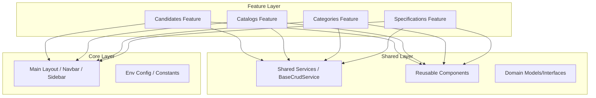
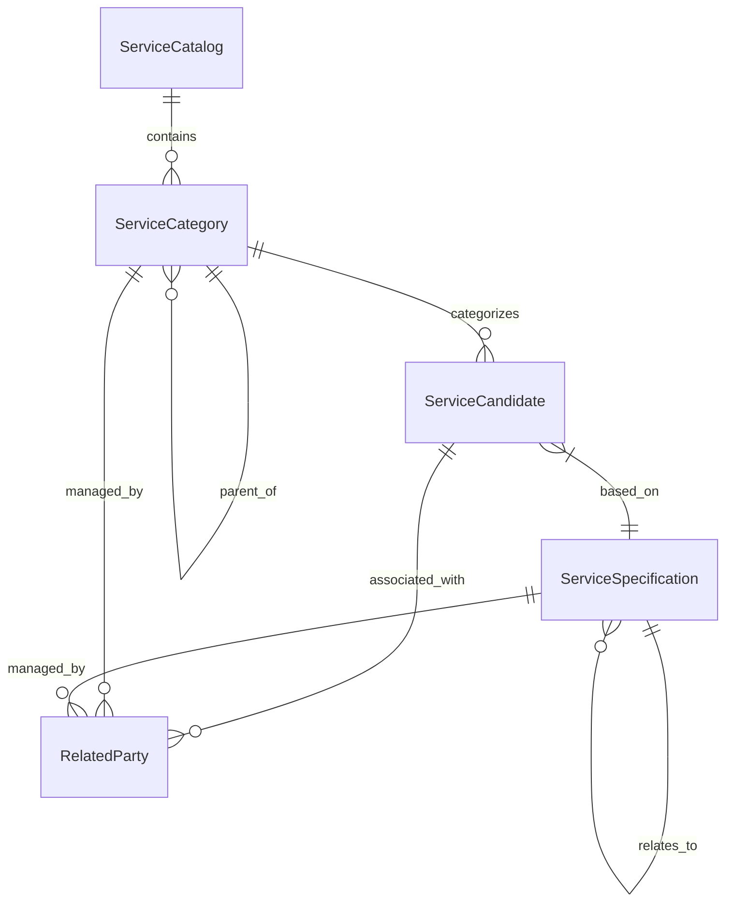

# Table of Contents
- [1. Introduction](#1-introduction)
- [In-Scope](#in-scope)
- [Out-of-Scope](#out-of-scope)
- [Architecture](#architecture)
- [Architectural Overview](#architectural-overview)
- [High-Level Component Diagram](#high-level-component-diagram)
- [Data Flow](#data-flow)
- [Key Design Patterns](#key-design-patterns)
- [Technology Stack](#technology-stack)
- [3. Package Structure](#3-package-structure)
- [├── core/                       # Singleton services, layout, and global components](#-core------------------------singleton-services-layout-and-global-components)
- [│   ├── components/             # Global UI components (Navbar, Sidebar, Breadcrumb)](#----components--------------global-ui-components-navbar-sidebar-breadcrumb)
- [│   ├── constants/              # Application-wide constants](#----constants---------------application-wide-constants)
- [│   └── layout/                 # Main application layout wrapper](#----layout------------------main-application-layout-wrapper)
- [├── features/                   # Business logic divided by domain modules](#-features--------------------business-logic-divided-by-domain-modules)
- [│   ├── candidates/             # Service candidate management](#----candidates--------------service-candidate-management)
- [│   ├── catalogs/               # Service catalog management](#----catalogs----------------service-catalog-management)
- [│   ├── categories/             # Service categorization](#----categories--------------service-categorization)
- [│   └── specifications/          # Service specifications and characteristics](#----specifications-----------service-specifications-and-characteristics)
- [└── shared/                     # Reusable utilities, components, and models](#-shared----------------------reusable-utilities-components-and-models)
- [├── components/             # Generic UI components (Modals, Filters, Search)](#-components--------------generic-ui-components-modals-filters-search)
- [├── constants/              # Shared constants (Error/State mapping)](#-constants---------------shared-constants-errorstate-mapping)
- [├── directives/             # Custom Angular directives](#-directives--------------custom-angular-directives)
- [├── i18n/                   # Internationalization (en, tr)](#-i18n--------------------internationalization-en-tr)
- [├── interceptors/           # HTTP interceptors](#-interceptors------------http-interceptors)
- [├── models/                 # Domain entity interfaces](#-models------------------domain-entity-interfaces)
- [├── pipes/                  # Custom Angular pipes](#-pipes-------------------custom-angular-pipes)
- [├── services/               # Generic API wrappers and base CRUD services](#-services----------------generic-api-wrappers-and-base-crud-services)
- [├── styles/                # Shared SCSS styles](#-styles-----------------shared-scss-styles)
- [├── utilities/              # Helper functions and interfaces](#-utilities---------------helper-functions-and-interfaces)
- [└── validators/            # Custom form validators](#-validators-------------custom-form-validators)
- [Core Module (`core/`)](#core-module-core)
- [Shared Module (`shared/`)](#shared-module-shared)
- [Features Module (`features/`)](#features-module-features)
- [4. Entities](#4-entities)
- [ServiceCandidate](#servicecandidate)
- [ServiceCategory](#servicecategory)
- [ServiceSpecification](#servicespecification)
- [ServiceCatalog](#servicecatalog)
- [5. Services](#5-services)
- [Common Methods](#common-methods)
- [Generic Type Handling](#generic-type-handling)
- [CandidateService](#candidateservice)
- [CategoryService](#categoryservice)
- [CatalogService](#catalogservice)
- [SpecificationService](#specificationservice)
- [API Design](#api-design)
- [Service Candidate](#service-candidate)
- [Service Category](#service-category)
- [Service Catalog](#service-catalog)
- [Service Specification](#service-specification)
- [7. Database](#7-database)
- [Configuration](#configuration)
- [Configuration Architecture](#configuration-architecture)
- [Environment-Specific Settings](#environment-specific-settings)
- [Infrastructure Parameters (`env-params.js`)](#infrastructure-parameters-env-paramsjs)
- [Application Settings (`app-config.js`)](#application-settings-app-configjs)
- [Application Constants](#application-constants)
- [Runtime Configuration](#runtime-configuration)
- [Internationalization (i18n) Config](#internationalization-i18n-config)
- [Testing](#testing)
- [Testing Strategy](#testing-strategy)
- [Unit Testing Framework](#unit-testing-framework)
- [Test Coverage Analysis](#test-coverage-analysis)
- [Mocking Strategy](#mocking-strategy)
- [Common Test Scenarios](#common-test-scenarios)
- [10. Deployment](#10-deployment)
- [Frontend](#frontend)
- [UI Framework & Component Library](#ui-framework--component-library)
- [Layout Structure](#layout-structure)
- [Key Pages & Workflows](#key-pages--workflows)
- [List View](#list-view)
- [Create/Update View](#createupdate-view)
- [Content/Detail View](#contentdetail-view)
- [State Management](#state-management)
- [Styling Strategy](#styling-strategy)
# 1. Introduction

## 1.1 Purpose
The purpose of the Service Catalog Management UI application is to provide a comprehensive interface for managing service catalog operations. It enables the definition, organization, and maintenance of service candidates, catalogs, categories, and detailed service specifications, ensuring a structured approach to service offering management.

## 1.2 Scope
### In-Scope
- **Service Candidate Management**: Configuration and management of service candidate definitions.
- **Service Catalog Hierarchy**: Creation and maintenance of service catalog structures.
- **Service Categorization**: Logical organization of services into category trees.
- **Service Specification**: Definition of detailed service characteristics, constraints, and relationships.
- **Entity Versioning**: Support for multi-versioning and soft-delete strategies.
- **Data Portability**: Import and export functionality for catalog entities.
- **Association Management**: Linking related parties, roles, and documentation (attachments) to catalog items.
- **Schema Support**: Support for target entity schemas such as RFS, NokiaRouter, and ZyxelModelSpecification.

### Out-of-Scope
- Backend API implementation (the application acts as a frontend consumer of v4 APIs).
- Real-time service provisioning or orchestration.
- Direct database administration.

## 1.3 Target Audience
The system is intended for:
- **Service Architects**: To define service specifications and hierarchies.
- **Product Managers**: To manage service candidates and catalog offerings.
- **System Administrators**: To maintain the organizational structure of the service catalog.

## 1.4 Definitions and Acronyms
| Term/Acronym | Definition |
| :--- | :--- |
| **Service Candidate** | A proposed service definition awaiting finalization or activation in the catalog. |
| **Service Specification** | A detailed technical definition of a service, including its characteristics and constraints. |
| **Service Category** | A logical grouping used to organize services within a catalog hierarchy. |
| **RFSS** | Resource Facing Service Specification. |
| **ACL Related Party** | Access Control List associated parties who have specific roles or interests in an entity. |
| **Lifecycle Status** | The current state of an entity in its operational lifecycle (e.g., "In study"). |
| **Target Entity Schema** | A custom model definition used to map specifications to specific hardware or software entities. |

## 1.5 References
The following key configuration and documentation files are central to the system:
- **Environment Parameters**: `.runner-work/component-source/env-params.js` (API endpoints and Auth configuration).
- **Application Configuration**: `.runner-work/component-source/app-config.js` (Platform settings and mappings).
- **Environment Config**: `.runner-work/component-source/src/app/env-config.ts` (TypeScript-based environment settings).
- **Project Documentation**: `.runner-work/component-source/README.md` (General overview and setup guides).


# Architecture

## Architectural Overview
The Service Catalog Management UI is built using **Angular 21**, following a modular, scalable architecture. The design employs the **Core/Shared pattern**, which separates global singleton services and layout components from reusable UI elements and feature-specific business logic.

The project is organized into three primary layers:
- **Core Layer**: Contains singleton services, global constants, and the main application layout (navbar, sidebar, breadcrumbs).
- **Shared Layer**: Provides reusable components, directives, pipes, and base services used across multiple features.
- **Feature Layer**: Implements the domain-specific business logic partitioned by functional modules (Candidates, Catalogs, Categories, and Specifications).

## High-Level Component Diagram


## Data Flow
Data moves through the application in a unidirectional flow:
1. **UI Components**: Feature components (e.g., `List`, `Form`) capture user interactions and trigger requests.
2. **Services**: Components call specialized services (e.g., `ServiceCandidateService`) which inherit from the `BaseCrudService`.
3. **API Layer**: Services utilize the Angular `HttpClient` (via `@dnext-angular/http`) to communicate with the Backend API.
4. **Interceptors**: Requests and responses are processed by `ErrorInterceptor` for centralized error handling.
5. **State Update**: Data is returned as `Observables` (RxJS), flowing back to the components to update the UI.

## Key Design Patterns
- **BaseCRUD Service**: An abstract `BaseCrudService` is used to standardize common CRUD operations (`list`, `retrieveById`, `patch`, `delete`, `create`, `filter`) across all entity services.
- **Singleton Core Services**: Services in the Core layer are provided in the root to ensure a single instance exists for the application lifetime.
- **Feature-based Routing**: Each feature module (Candidates, Catalogs, etc.) defines its own routes in a `routes.ts` file, enabling lazy loading and clear separation of concerns.
- **Model-Driven Development**: Strong typing is enforced using TypeScript interfaces in the `shared/models` directory, ensuring consistency between the API and the UI.

## Technology Stack
| Technology | Version | Description |
|---|---|---|
| **Angular** | 21.2.0 | Frontend Framework |
| **TypeScript** | 5.9.2 | Programming Language |
| **RxJS** | 7.8.0 | Reactive Extensions for asynchronous data streams |
| **@dnext-ui-kit** | 3.1.20 | Internal UI Component Library |
| **@ngx-translate** | 15.0.0 | Internationalization (i18n) support |
| **Nginx** | - | Web Server for production deployment |
| **Docker** | - | Containerization |


# 3. Package Structure

## 3.1 Directory Hierarchy
The project follows a feature-based module architecture centered around the `src/app` directory.

```text
src/app/
├── core/                       # Singleton services, layout, and global components
│   ├── components/             # Global UI components (Navbar, Sidebar, Breadcrumb)
│   ├── constants/              # Application-wide constants
│   └── layout/                 # Main application layout wrapper
├── features/                   # Business logic divided by domain modules
│   ├── candidates/             # Service candidate management
│   ├── catalogs/               # Service catalog management
│   ├── categories/             # Service categorization
│   └── specifications/          # Service specifications and characteristics
└── shared/                     # Reusable utilities, components, and models
    ├── components/             # Generic UI components (Modals, Filters, Search)
    ├── constants/              # Shared constants (Error/State mapping)
    ├── directives/             # Custom Angular directives
    ├── i18n/                   # Internationalization (en, tr)
    ├── interceptors/           # HTTP interceptors
    ├── models/                 # Domain entity interfaces
    ├── pipes/                  # Custom Angular pipes
    ├── services/               # Generic API wrappers and base CRUD services
    ├── styles/                # Shared SCSS styles
    ├── utilities/              # Helper functions and interfaces
    └── validators/            # Custom form validators
```

## 3.2 Module Responsibilities

### Core Module (`core/`)
The Core module contains singleton services and components that are instantiated once per application lifecycle. Its primary responsibility is the application shell, including the main `layout`, `navbar`, and `sidebar`, providing a consistent navigation framework.

### Shared Module (`shared/`)
The Shared module provides a library of reusable building blocks used across multiple features. It includes:
- **Models**: TypeScript interfaces defining the domain entities (e.g., `serviceCandidate.model.ts`).
- **Services**: Generic API communication logic, including the `base-crud.service.ts` used by feature services.
- **UI Components**: Generic input components like `multi-select-search` and `filter`.
- **Cross-cutting Concerns**: Internationalization (`i18n`), HTTP `interceptors`, and custom `validators`.

### Features Module (`features/`)
The Features module encapsulates the core business logic of the application, divided into domain-specific sub-modules:
- **Candidates**: Manages the lifecycle and data of service candidates.
- **Catalogs**: Handles the organization and management of service catalogs.
- **Categories**: Implements logic for service categorization.
- **Specifications**: Manages detailed technical specifications, characteristics, and relationships of services.

Each feature module typically follows a consistent internal structure consisting of `components/` (list, form, content) and `routes.ts`.

## 3.3 Naming Conventions
The project adheres to Angular's official style guide for file naming to ensure predictability and maintainability:

| Pattern | Purpose | Example |
| :--- | :--- | :--- |
| `*.component.ts/html/scss` | UI Component logic and templates | `list.component.ts` |
| `*.service.ts` | Data access and business logic | `service-catalog.service.ts` |
| `*.model.ts` | TypeScript interfaces/types for entities | `serviceSpecification.model.ts` |
| `*.routes.ts` | Route definitions for a module | `routes.ts` |
| `*.directive.ts` | DOM manipulation directives | `clipboard.directive.ts` |
| `*.pipe.ts` | Data transformation pipes | `formatDate.pipe.ts` |
| `*.constant.ts` | Static configuration values | `errorMapping.constant.ts` |
| `*.spec.ts` | Unit tests for the corresponding file | `app.component.spec.ts` |

## 3.4 Dependency Graph
The application follows a strict hierarchical dependency flow to prevent circular dependencies and maintain separation of concerns:

**Feature Modules $\rightarrow$ Shared Module $\rightarrow$ Core Module**

- **Feature Modules**: Depend on the `Shared` module for models, generic components, and base services. They may also depend on `Core` for global layout integration.
- **Shared Module**: Operates independently of feature modules. It contains generic logic that can be consumed by any part of the application.
- **Core Module**: Contains the top-level shell. While it provides the environment for features to be loaded, it generally does not depend on specific feature logic.


# 4. Entities

This section describes the domain entities, their relationships, and data definitions used within the Service Catalog system.

## 4.1 Entity-Relationship Diagram (ERD)

The following diagram illustrates the relationships between the primary domain models.



## 4.2 Detailed Entity Definitions

### ServiceCandidate
Represents a service offered in the catalog, acting as an instance or a candidate for a specific service specification.

| Property Name | Type | Description |
| :--- | :--- | :--- |
| `id` | `string` | Unique identifier of the service candidate |
| `name` | `string` | Name of the service candidate |
| `description` | `string` | Detailed description of the service |
| `lifecycleStatus` | `string` | Current status in the lifecycle (e.g., Active, Retired) |
| `validFor` | `TimePeriod` | Time period during which the candidate is valid |
| `version` | `string` | Version of the candidate entity |
| `href` | `string` | Resource URL reference |
| `category` | `Array<ServiceCategoryRef>` | Categories the candidate belongs to |
| `serviceSpecification` | `ServiceSpecificationRef` | The underlying specification this candidate implements |
| `aclRelatedParty` | `Array<RelatedParty>` | Parties with access or relationship to this candidate |

**Constraints:**
- `serviceSpecification` is required when creating a new `ServiceCandidate`.

---

### ServiceCategory
Defines the hierarchical categorization of services.

| Property Name | Type | Description |
| :--- | :--- | :--- |
| `id` | `string` | Unique identifier of the category |
| `name` | `string` | Name of the category |
| `description` | `string` | Description of the category |
| `lifecycleStatus` | `string` | Current lifecycle status |
| `version` | `string` | Version of the category entity |
| `href` | `string` | Resource URL reference |
| `validFor` | `TimePeriod` | Validity period of the category |
| `isRoot` | `boolean` | Indicates if this is a top-level category |
| `parentId` | `string` | Identifier of the parent category |
| `parent` | `ServiceCategoryRef` | Reference to the parent category object |
| `category` | `Array<ServiceCategoryRef>` | List of child categories |
| `serviceCandidate` | `Array<ServiceCandidateRef>` | Services associated with this category |
| `aclRelatedParty` | `Array<RelatedParty>` | Parties associated with this category |

**Constraints:**
- Hierarchical structure is maintained via `parentId` and `category` (children) list.

---

### ServiceSpecification
The blueprint or template that defines the characteristics and rules for a service.

| Property Name | Type | Description |
| :--- | :--- | :--- |
| `id` | `string` | Unique identifier of the specification |
| `name` | `string` | Name of the specification |
| `description` | `string` | Description of the specification |
| `lifecycleStatus` | `string` | Lifecycle status (default: 'In study') |
| `version` | `string` | Version of the specification |
| `href` | `string` | Resource URL reference |
| `validFor` | `TimePeriod` | Validity period |
| `isBundle` | `boolean` | Whether this is a bundle of multiple specifications |
| `bundledServiceSpecification` | `Array<BundledServiceSpecification>` | Specifications included in this bundle |
| `specCharacteristic` | `Array<CharacteristicSpecification>` | Defined characteristics of the service |
| `serviceSpecRelationship` | `Array<ServiceSpecRelationship>` | Relationships to other specifications |
| `relatedParty` | `Array<RelatedParty>` | Parties with interest in this specification |
| `aclRelatedParty` | `Array<RelatedParty>` | Access control related parties |

**Constraints:**
- `lifecycleStatus` defaults to 'In study' upon creation.

---

### ServiceCatalog
The top-level container for service categories and their associated candidates.

| Property Name | Type | Description |
| :--- | :--- | :--- |
| `name` | `string` | Name of the service catalog |
| `description` | `string` | Description of the catalog |
| `lifecycleStatus` | `string` | Current lifecycle status |
| `category` | `Array<ServiceCategoryRef>` | Categories included in this catalog |
| `catalogType` | `string` | Identifier for the type of catalog |
| `validFor` | `TimePeriod` | Validity period of the catalog |
| `relatedParty` | `Array<RelatedParty>` | Related parties for the catalog |
| `aclRelatedParty` | `Array<RelatedParty>` | Access control parties |

## 4.3 Data Types Mapping

| TypeScript Type | Conceptual Data Type | Description |
| :--- | :--- | :--- |
| `string` | `String / UUID` | Textual data or unique identifiers |
| `number` | `Integer / Decimal` | Numeric values (e.g., revision numbers) |
| `boolean` | `Boolean` | True/False flags |
| `Date` | `DateTime` | ISO date and time stamps |
| `Array<T>` | `Collection` | List of related entities or references |
| `TimePeriod` | `Interval` | Object containing `startDateTime` and `endDateTime` |
| `Ref` (e.g. `ServiceCategoryRef`) | `Reference` | A lightweight pointer to another entity (usually containing `id` and `href`) |

## 4.4 Common Patterns

Across the domain models, several recurring patterns are identified:

1. **Identity and Versioning**: Most entities implement `id`, `version`, and `href` for resource identification and tracking.
2. **Lifecycle Management**: `lifecycleStatus` is a standard property across all primary entities, governed by the `LIFE_CYCLE_STATUS` enum.
3. **Temporal Validity**: The `validFor` property (of type `TimePeriod`) is used consistently to define the active window of an entity.
4. **Access Control**: `aclRelatedParty` is used to manage party-based permissions and associations.
5. **Audit Metadata**: `ServiceCategory` and `ServiceSpecification` include audit fields: `createdBy`, `updatedBy`, `createdDate`, `updatedDate`, and `revision`.


# 5. Services

## 5.1 Service Layer Overview
The application employs a tiered service architecture designed for consistency and reusability. The core of the data access layer is the `BaseCrudService`, an abstract base class that defines the standard interface for CRUD (Create, Read, Update, Delete) operations. Entity-specific services (e.g., `CandidateService`, `CategoryService`) extend this base class, implementing the abstract methods by delegating the actual API calls to specialized SDK services provided by the `@dnext-angular/service-catalog` library.

## 5.2 BaseCrudService Analysis
The `BaseCrudService` provides a generic blueprint for all entity services, ensuring a uniform API across different domain entities.

### Common Methods
The base service defines the following abstract methods that must be implemented by any inheriting service:
- `list(offset: number, limit: number)`: Retrieves a paginated list of entities.
- `retrieveById(id: string)`: Fetches a single entity by its unique identifier.
- `create(data: TCreate)`: Creates a new entity using the provided creation DTO.
- `patch(id: string, data: any)`: Updates an existing entity by its ID.
- `delete(id: string)`: Removes an entity by its ID.
- `filter(...)`: Provides advanced filtering, sorting, and pagination capabilities.

### Generic Type Handling
`BaseCrudService` utilizes TypeScript generics to ensure type safety:
- `<T>`: Represents the entity type (e.g., `ServiceCandidate`), used for return types of retrieval and update operations.
- `<TCreate>`: Represents the Data Transfer Object (DTO) used specifically for creating new entities (e.g., `ServiceCandidateCreate`).

## 5.3 Entity Service Detailed Analysis

### CandidateService
- **Purpose**: Encapsulates domain logic for managing service candidates, including version-specific operations.
- **Specialized Methods**:
  - `retrieveByVersion(id, version)`: Retrieves a specific version of a candidate.
  - `patchByVersion(id, version, data)`: Updates a specific version of a candidate.
  - `filter(...)`: Implements complex filtering including `lifecycleStatus`, date ranges (`validFor`), and fuzzy name/ID searches.

### CategoryService
- **Purpose**: Handles the management and categorization of services.
- **Specialized Methods**:
  - `filter(...)`: Includes specific filters for `isRoot` (to distinguish top-level categories) and description-based searches.

### CatalogService
- **Purpose**: Manages service catalogs.
- **Specialized Methods**:
  - `filter(...)`: Implements standardized catalog filtering with a default sort on `createdDate`.

### SpecificationService
- **Purpose**: Manages detailed technical specifications and characteristics of services.
- **Specialized Methods**:
  - `retrieveByVersion(id, version)`: Retrieves a specific version of a specification.
  - `patchByVersion(id, version, data)`: Updates a specific version of a specification.
  - `filter(...)`: Supports `status` and raw `filter` parameter queries.

## 5.4 Service Dependency Graph
The services follow a linear dependency chain for data retrieval:

**Component** $\rightarrow$ **Entity Service** (e.g., `CandidateService`) $\rightarrow$ **SDK Service** (e.g., `ServiceCandidateService` from `@dnext-angular/service-catalog`) $\rightarrow$ **HttpClient** (Internal to SDK)

Additionally, some services utilize internal helpers:
- `CatalogService` $\rightarrow$ `FilterService`
- All Entity Services $\rightarrow$ `ENV_CONFIG` (for API base paths)


# API Design

## 1. API Architectural Style
The application follows a **RESTful** architectural style, utilizing **JSON-over-HTTP** for communication between the Angular frontend and the backend services. The frontend leverages a service-oriented data access layer where entity-specific services extend a `BaseCrudService` to ensure consistent API interaction patterns.

## 2. Base Endpoints
The base path for all service catalog related entities is configured via the `serviceCatalogApi` environment variable.

| Entity | Base Path |
| :--- | :--- |
| Service Candidate | `/serviceCandidate` |
| Service Category | `/serviceCategory` |
| Service Catalog | `/serviceCatalog` |
| Service Specification | `/serviceSpecification` |

## 3. Endpoint Specification

### Service Candidate
| Method | Path | Request Parameters/Body | Response |
| :--- | :--- | :--- | :--- |
| GET | `/serviceCandidate` | Query: `offset`, `limit` | `ServiceCandidate[]` |
| GET | `/serviceCandidate/{id}` | Path: `id` | `ServiceCandidate` |
| GET | `/serviceCandidate/{id}/version/{version}` | Path: `id`, `version` | `ServiceCandidate` |
| POST | `/serviceCandidate` | Body: `ServiceCandidateCreate` | `ServiceCandidate` |
| PATCH | `/serviceCandidate/{id}` | Body: JSON Patch data | `ServiceCandidate` |
| PATCH | `/serviceCandidate/{id}/version/{version}` | Path: `version`, Body: JSON Patch data | `ServiceCandidate` |
| DELETE | `/serviceCandidate/{id}` | Path: `id` | `void` |
| GET | `/serviceCandidate/filter` | Query: `id`, `name`, `lifecycleStatus`, `startDateTime`, `endDateTime`, `idExclude`, `limit`, `offset`, `sort` | `ServiceCandidate[]` |

### Service Category
| Method | Path | Request Parameters/Body | Response |
| :--- | :--- | :--- | :--- |
| GET | `/serviceCategory` | Query: `offset`, `limit` | `ServiceCategory[]` |
| GET | `/serviceCategory/{id}` | Path: `id` | `ServiceCategory` |
| POST | `/serviceCategory` | Body: `ServiceCategoryCreate` | `ServiceCategory` |
| PATCH | `/serviceCategory/{id}` | Body: JSON Patch data | `ServiceCategory` |
| DELETE | `/serviceCategory/{id}` | Path: `id` | `void` |
| GET | `/serviceCategory/filter` | Query: `id`, `name`, `description`, `startDateTime`, `endDateTime`, `isRoot`, `idExclude`, `offset`, `limit` | `ServiceCategory[]` |

### Service Catalog
| Method | Path | Request Parameters/Body | Response |
| :--- | :--- | :--- | :--- |
| GET | `/serviceCatalog` | Query: `offset`, `limit` | `ServiceCatalog[]` |
| GET | `/serviceCatalog/{id}` | Path: `id` | `ServiceCatalog` |
| POST | `/serviceCatalog` | Body: `ServiceCatalogCreate` | `ServiceCatalog` |
| PATCH | `/serviceCatalog/{id}` | Body: JSON Patch data | `ServiceCatalog` |
| DELETE | `/serviceCatalog/{id}` | Path: `id` | `void` |
| GET | `/serviceCatalog/filter` | Query: `id`, `name`, `description`, `startDateTime`, `endDateTime`, `idExclude`, `offset`, `limit` | `ServiceCatalog[]` |

### Service Specification
| Method | Path | Request Parameters/Body | Response |
| :--- | :--- | :--- | :--- |
| GET | `/serviceSpecification` | Query: `offset`, `limit` | `ServiceSpecification[]` |
| GET | `/serviceSpecification/{id}` | Path: `id` | `ServiceSpecification` |
| GET | `/serviceSpecification/{id}/version/{version}` | Path: `id`, `version` | `ServiceSpecification` |
| POST | `/serviceSpecification` | Body: `ServiceSpecificationCreate` | `ServiceSpecification` |
| PATCH | `/serviceSpecification/{id}` | Body: JSON Patch data | `ServiceSpecification` |
| PATCH | `/serviceSpecification/{id}/version/{version}` | Path: `version`, Body: JSON Patch data | `ServiceSpecification` |
| DELETE | `/serviceSpecification/{id}` | Path: `id` | `void` |
| GET | `/serviceSpecification/filter` | Query: `id`, `name`, `description`, `status`, `lifecycleStatus`, `filter`, `startDateTime`, `endDateTime`, `idExclude`, `limit`, `offset` | `ServiceSpecification[]` |

## 4. Error Handling
API errors are handled globally using the `ErrorInterceptor` (`src/app/shared/interceptors/error.interceptor.ts`). 
- **HTTP 404 & 500**: The interceptor automatically redirects the user to the `/not-found` route.
- **Field-level Errors**: The `UtilService.getFieldErrorMessage` method is used to map backend validation errors to user-friendly translation keys based on a predefined `ERROR_PRIORITY` constant.

## 5. Authentication/Authorization
The application relies on the `@dnext-angular/service-catalog` library and `ENV_CONFIG` for API communication. While the specific token mechanism is encapsulated within the library services, it typically utilizes standard HTTP headers (e.g., Bearer tokens) injected via interceptors to identify and authorize requests to the `serviceCatalogApi` base URL.


# 7. Database

## 7.1 Data Storage Paradigm
Based on the entity relationships and domain models, the backend is inferred to use a **Relational (SQL)** storage paradigm. This is evidenced by:
- **Strong Typing and Structured Entities**: Entities like `ServiceCandidate`, `ServiceCategory`, and `ServiceSpecification` have well-defined schemas.
- **Explicit Foreign Key Relationships**: The use of `parentId` in `ServiceCategoryModel` and `ServiceSpecificationRef` in `ServiceCandidateModel` indicates a normalized relational structure with parent-child and reference-based associations.
- **Complex Versioning and Lifecycle Management**: The implementation of strict versioning (e.g., `version '0'` for pre-active status, incremental integers for released versions) and lifecycle state transitions is characteristic of relational auditing and versioning tables.

## 7.2 Inferred Schema

### 7.2.1 Service Candidate (`service_candidates`)
| Field | Type | Key | Description |
| :--- | :--- | :--- | :--- |
| `id` | UUID/String | PK | Unique identifier for the candidate |
| `version` | String | PK/Composite | Version identifier (e.g., '0', '1') |
| `name` | String | | Name of the service candidate |
| `description` | Text | | Detailed description |
| `lifecycleStatus` | String | | Current status (In Study, Active, etc.) |
| `serviceSpecificationId`| UUID/String | FK | Reference to `service_specifications.id` |
| `validFor_start` | DateTime | | Validity start date/time |
| `validFor_end` | DateTime | | Validity end date/time |

### 7.2.2 Service Category (`service_categories`)
| Field | Type | Key | Description |
| :--- | :--- | :--- | :--- |
| `id` | UUID/String | PK | Unique identifier for the category |
| `version` | String | PK/Composite | Version identifier |
| `name` | String | | Category name |
| `parentId` | UUID/String | FK | Reference to `service_categories.id` (Self-reference) |
| `isRoot` | Boolean | | Indicates if it is a top-level category |
| `lifecycleStatus` | String | | Current status |

### 7.2.3 Service Specification (`service_specifications`)
| Field | Type | Key | Description |
| :--- | :--- | :--- | :--- |
| `id` | UUID/String | PK | Unique identifier for the specification |
| `version` | String | PK/Composite | Version identifier |
| `name` | String | | Specification name |
| `isBundle` | Boolean | | Indicates if it's a bundle of specifications |
| `lifecycleStatus` | String | | Current status |
| `targetEntitySchema` | JSON/Text | | Definition of the target entity schema |

### 7.2.4 Relationships Summary
- **Candidate $\rightarrow$ Category**: Many-to-Many (handled via `category` array of references).
- **Candidate $\rightarrow$ Specification**: Many-to-One (`serviceSpecification` reference).
- **Category $\rightarrow$ Category**: One-to-Many (Self-referencing via `parentId`).
- **Specification $\rightarrow$ Specification**: Many-to-Many (Self-referencing via `serviceSpecRelationship`).

## 7.3 Versioning Strategy
The system employs a **Version-per-Record** strategy, likely using a composite primary key consisting of `(id, version)`.
- **Draft/Pre-Active Version**: A special version `'0'` is used for entities in design or test phases. Only version `'0'` is typically editable before release.
- **Released Versions**: Once an entity moves to an active/launched status, the version is incremented (e.g., `Math.max(...versions) + 1`).
- **Soft vs Multi Versioning**: 
    - **MULTI**: Supports multiple concurrent released versions; transitioning to a new active version involves updating the `endDateTime` of the previous version to maintain a continuous timeline.
    - **SOFT**: A more restrictive versioning approach where released entities follow a strict lifecycle (Retired $\rightarrow$ Obsolete $\rightarrow$ Remove).
- **Immutable History**: Use of `patchByVersion` suggests that once a version is released, it is treated as nearly immutable, and changes require a new version.

## 7.4 Temporal Data Handling
Temporal validity is managed via the `TimePeriod` model (stored as `validFor`):
- **Storage**: Likely stored as two separate columns: `start_date_time` and `end_date_time`.
- **Querying**: The `CatalogService.filter` implementation indicates the use of range queries:
    - `startDateTime` uses a "greater than" filter.
    - `endDateTime` uses a "less than" filter.
- **Lifecycle Integration**: Validity periods are strictly tied to lifecycle status changes (e.g., `moveToRetired` requires an `endDateTime`, `moveToActive` requires a `startDateTime`).


# Configuration

## Configuration Architecture
The application employs a multi-layer configuration strategy to ensure flexibility across different deployment environments:
1.  **Environment Parameters (`env-params.js`)**: Defines low-level infrastructure settings such as domain suffixes and OIDC issuer URLs. These are attached to the global `window` object as `__env_params`.
2.  **Application Configuration (`app-config.js`)**: Consumes parameters from `env-params.js` to define high-level application settings, including platform branding, feature flags, and schema locations. These are attached to the global `window` object as `__env`.
3.  **TypeScript Configuration (`env-config.ts`)**: Acts as the internal bridge. It reads the global `__env` and `__env_params` objects and resolves them into a typed `IConfig` object. This layer handles the construction of full API URLs by combining prefixes and suffixes.
4.  **Environment Variables**: Infrastructure-level variables (managed via CI/CD or Docker) are injected into the JS configuration files during the build/deployment process.

## Environment-Specific Settings
Settings are split between infrastructure parameters and application behavior:

### Infrastructure Parameters (`env-params.js`)
- `domain_name_suffix`: The base domain for the deployment (e.g., `dnext.dev.orbitant.dev`).
- `domain_name_prefix_mode`: Determines if sub-domains are fixed or variable.
- `auth`: OAuth2/OIDC settings including `issuer`, `clientId`, and `redirectUri`.

### Application Settings (`app-config.js`)
- `platformName` & `platformInfo`: Branding and contact information.
- `TARGET_ENTITY_SCHEMA`: Mapping of models (e.g., `RFS`, `NokiaRouter`) to their JSON schema locations.
- `versioningOption`: Configures versioning behavior (e.g., `MULTI` or `SOFT`).
- `serviceListItems`: Granular control over which properties (e.g., `id`, `name`, `lifeCycle`) are visible in the UI lists for catalogs, categories, candidates, and specifications.

## Application Constants
Global constants are used to maintain consistency in business logic and UI state:
- **State Mapping**: `STATE_MAPPING` in `src/app/shared/constants/stateMapping.constant.ts` defines the visual representation (icon, title, color) for lifecycle states such as `Launched`, `Active`, `Retired`, and `Obsolete`.
- **Workflow Logic**: `NEXT_STATE_MAPPING` defines the valid state transitions (e.g., `In design` $\rightarrow$ `In test`).
- **Error Mapping**: `ERROR_PRIORITY` in `src/app/shared/constants/errorMapping.constant.ts` maps validation keys (e.g., `required`, `email`) to i18n translation keys.

## Runtime Configuration
The configuration is loaded during the application bootstrap process:
1.  `env-params.js` and `app-config.js` are loaded as script tags in `index.html` before the main Angular bundle.
2.  The `AppConfigFactory` in `src/app/env-config.ts` is triggered via the `ENV_CONFIG` injection token.
3.  The factory merges the hardcoded `dependencyConfig` (containing API paths like `/api/serviceCatalogManagement/v4`) with any overrides provided in `app-config.js`.
4.  The final configuration is injected throughout the application, allowing services to access resolved API endpoints.

## Internationalization (i18n) Config
The application implements a type-safe i18n system using TypeScript files instead of static JSON:
- **Structure**: Translation files are located in `src/app/shared/i18n/` (e.g., `en.ts`, `tr.ts`).
- **Organization**: Translations are grouped by functional area:
    - `HEADERS`: Column names and section titles.
    - `PLACEHOLDERS`: Input field hints.
    - `BUTTONS`: Action labels.
    - `MESSAGES`: Dialog content and success/error notifications.
    - `ERRORS`: Validation messages.
- **Loading**: Locales are imported in `src/app/app.config.ts` and managed via a translation schema (`translateSchema.ts`) to ensure all required keys are present across supported languages.


# Testing

## Testing Strategy
The application follows a comprehensive testing strategy primarily focused on **Unit Testing** and **Component Testing**. The approach ensures that individual business logic units (services) and UI components are validated in isolation. 

- **Unit Testing**: Focuses on services in `shared/services` to validate API interaction logic and data transformations.
- **Component Testing**: Focuses on the UI layer, ensuring that components in `features/` and `shared/components` render correctly and handle user interactions as expected.
- **Integration Testing**: Performed implicitly through `TestBed` configurations that integrate components with their dependent services.

## Unit Testing Framework
The project uses the standard Angular testing stack:
- **Jasmine**: Used as the behavior-driven development (BDD) framework for writing test specifications.
- **Karma**: Used as the test runner to execute tests in a browser environment (configured via `@angular/build:karma` in `angular.json`).
- **Angular TestBed**: The primary utility for configuring and initializing the testing module for components and services.

## Test Coverage Analysis
The test suite is broadly distributed across the application, with a high density of `*.spec.ts` files:
- **Heavily Tested Areas**:
    - **Features**: Extensive coverage for `candidates`, `catalogs`, `categories`, and `specifications` features, including complex forms and list views.
    - **Shared Components**: High coverage for reusable UI elements in `shared/components` (e.g., `filter`, `item-card`, `related-party`).
    - **Core Components**: Validation of layout elements such as `sidebar`, `navbar`, and `breadcrumb`.
    - **Shared Services**: Core API wrappers (e.g., `service-catalog`, `service-category`) have dedicated specification files.
- **Distribution**: Almost every component and service in the `src/app` directory has a corresponding `.spec.ts` file, indicating a goal of high structural coverage.

## Mocking Strategy
The application employs several mocking techniques to isolate tests from external dependencies:
- **Service Mocking**: Use of `TestBed.inject()` to retrieve service instances and potentially replacing them with spies.
- **Dependency Injection**: Leveraging `TestBed.configureTestingModule` to provide mock implementations of services to components.
- **HTTP Mocking**: While the provided snippets show basic creation tests, the structure suggests the use of `HttpClientTestingModule` (standard for Angular services) to mock backend API responses.

## Common Test Scenarios
Based on the test distribution, the following scenarios are typically validated:
- **Component Lifecycle**: Ensuring components are created successfully (`should create`).
- **UI Rendering**: Validating that components in `features/` render the expected content based on provided data.
- **Service Integrity**: Checking that API services are correctly instantiated and available for injection.
- **Feature-Specific Logic**: 
    - Validating form inputs and submissions in `create` and `update` components.
    - Testing the filtering and listing logic in `list.component.spec.ts`.
    - Ensuring correct tab switching and general information display in content components.


# 10. Deployment

## 10.1 Build Process
The application is built using the Angular CLI. The build process is managed via npm scripts defined in `package.json`.
- **Development Build**: `npm run build` (runs `ng build`)
- **Production Build**: `npm run build:prod` (runs `ng build --configuration production`)
- **Build Tooling**: Uses `@angular/build` and `@angular/cli` version 21.2.0.

## 10.2 Artifacts
The build output is generated in the `dist/dnext` directory.
- **Production Artifacts**: The final browser-ready assets are located at `dist/dnext/browser`, which include the compiled JavaScript bundles, CSS, and static assets.

## 10.3 Deployment Infrastructure
### 10.3.1 Web Server
The application is served using **Nginx** (version 1.29.5). The Nginx configuration is located in `nginx/default.conf` and is used to route requests to the Angular application.

### 10.3.2 Containerization
The application is containerized using **Docker** via a multi-stage `Dockerfile` located in `docker/Dockerfile`:
- **Stage 1 (Build)**: Uses `node:25.6.0` to install dependencies and execute `npm run build:prod`.
- **Stage 2 (Runtime)**: Uses `nginx:1.29.5` to serve the static files from the build stage.
- **Entrypoint**: An `entrypoint.sh` script is used to handle container startup logic.

## 10.4 Environment Pipeline
Environment-specific configurations are handled through external JavaScript files that are injected into the build artifacts:
- **`env-params.js`**: Contains environment-specific parameters such as `domainNameSuffix` and OIDC issuer details.
- **`app-config.js`**: Contains application-level configurations, including platform information and API schema definitions.
- **Injection Process**: During the Docker build process, these files are copied directly into the `dist/dnext/browser/assets/js/` directory, allowing the application to load environment settings at runtime without requiring a full rebuild of the TypeScript code.

## 10.5 CI/CD Integration
Based on the project metadata, the project uses **Jenkins** for its CI/CD pipeline to automate the build, containerization, and deployment processes.


# Frontend

## UI Framework & Component Library
The frontend is built with **Angular 21.2.0**. It utilizes a specialized component library, **@dnext-ui-kit**, for core UI elements (e.g., `DxVerticalList`, `tab-group`, `spinner`) and **@dnext-angular/utilities** for helper functions like `createPatch`.

## Layout Structure
The application follows a global shell pattern implemented in `src/app/core/components`:
- **Navbar**: Top navigation bar for global actions and branding.
- **Sidebar**: Navigation menu for switching between features and entities.
- **Breadcrumbs**: Path tracking for deep-nested views (e.g., `service-candidates/{id}/{version}`).
- **Content Area**: Main dynamic region where feature-specific components (List, Create/Update, Detail) are rendered via `RouterOutlet`.

## Key Pages & Workflows
The application implements a consistent pattern across the **Candidates**, **Catalogs**, **Categories**, and **Specifications** features:

### List View
- **Presentation**: Entities are displayed using a `VerticalListComponent` (wrapping `DxVerticalList`), where each entry is represented by a `ListItemComponent`.
- **Filtering & Search**: Uses a `FilterService` to manage search criteria and pagination data. A debounce mechanism (300ms) is applied to search inputs to optimize API calls.
- **Pagination**: Managed via `paginatorData` (offset, limit, sortBy) passed to the backend.

### Create/Update View
- **Form Structure**: Implemented using Angular `FormGroup` and `FormBuilder`. Complex forms are split into sub-components (e.g., `GeneralFormComponent`).
- **Validation**: Forms utilize Angular's built-in validation; the "Save" button is disabled if the form is `invalid` or `pristine`.
- **Submission**: 
  - **Creation**: Data is mapped via models (e.g., `ServiceCandidateModel`) and sent via `create()` service methods.
  - **Update**: Uses a patching mechanism (`createPatch`) to send only modified fields to the server.
- **Cloning**: Supports cloning existing entities by stripping identifiers and prefixing names (e.g., `Clone_`).

### Content/Detail View
- **Presentation**: Information is organized into a tabbed interface using `@dnext/ui-kit/components/core/tab-group`.
- **Data Loading**: Components retrieve entity details by ID and version. Complex views (like Categories) perform parallel requests using `forkJoin` to enrich related entity data.
- **Actions**: An `AdvancedActionMenuComponent` provides context-aware actions such as Edit, Clone, and Delete.

## State Management
The UI state is managed through a combination of:
- **Services & RxJS**: Domain-specific services (e.g., `CandidateService`) handle data fetching, while `FilterService` acts as a state container for search and pagination across list views.
- **Angular Signals**: Modern state primitives (`signal`, `computed`) are used for reactive UI updates, such as visibility toggles (`showExternalNavbar`) and item selection.
- **Observables**: RxJS `Subject` and `Subscription` are used to handle asynchronous events and prevent memory leaks via `takeUntil` patterns.

## Styling Strategy
- **Language**: **SCSS** is used for all styling.
- **Scope**: The project employs **Component-level styling** (`styleUrl: './component.scss'`), ensuring styles are encapsulated and do not leak between components.
- **Global Styles**: Core layout components (Navbar, Sidebar) define the primary shell appearance, while `@dnext-ui-kit` provides standardized design tokens.


