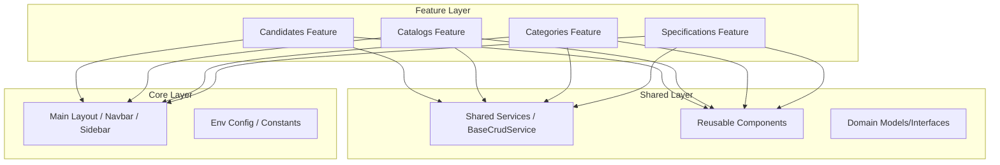

# Architecture

## Architectural Overview
The Service Catalog Management UI is built using **Angular 21**, following a modular, scalable architecture. The design employs the **Core/Shared pattern**, which separates global singleton services and layout components from reusable UI elements and feature-specific business logic.

The project is organized into three primary layers:
- **Core Layer**: Contains singleton services, global constants, and the main application layout (navbar, sidebar, breadcrumbs).
- **Shared Layer**: Provides reusable components, directives, pipes, and base services used across multiple features.
- **Feature Layer**: Implements the domain-specific business logic partitioned by functional modules (Candidates, Catalogs, Categories, and Specifications).

## High-Level Component Diagram

## Data Flow
Data moves through the application in a unidirectional flow:
1. **UI Components**: Feature components (e.g., `List`, `Form`) capture user interactions and trigger requests.
2. **Services**: Components call specialized services (e.g., `ServiceCandidateService`) which inherit from the `BaseCrudService`.
3. **API Layer**: Services utilize the Angular `HttpClient` (via `@dnext-angular/http`) to communicate with the Backend API.
4. **Interceptors**: Requests and responses are processed by `ErrorInterceptor` for centralized error handling.
5. **State Update**: Data is returned as `Observables` (RxJS), flowing back to the components to update the UI.

## Key Design Patterns
- **BaseCRUD Service**: An abstract `BaseCrudService` is used to standardize common CRUD operations (`list`, `retrieveById`, `patch`, `delete`, `create`, `filter`) across all entity services.
- **Singleton Core Services**: Services in the Core layer are provided in the root to ensure a single instance exists for the application lifetime.
- **Feature-based Routing**: Each feature module (Candidates, Catalogs, etc.) defines its own routes in a `routes.ts` file, enabling lazy loading and clear separation of concerns.
- **Model-Driven Development**: Strong typing is enforced using TypeScript interfaces in the `shared/models` directory, ensuring consistency between the API and the UI.

## Technology Stack
| Technology | Version | Description |
|---|---|---|
| **Angular** | 21.2.0 | Frontend Framework |
| **TypeScript** | 5.9.2 | Programming Language |
| **RxJS** | 7.8.0 | Reactive Extensions for asynchronous data streams |
| **@dnext-ui-kit** | 3.1.20 | Internal UI Component Library |
| **@ngx-translate** | 15.0.0 | Internationalization (i18n) support |
| **Nginx** | - | Web Server for production deployment |
| **Docker** | - | Containerization |
