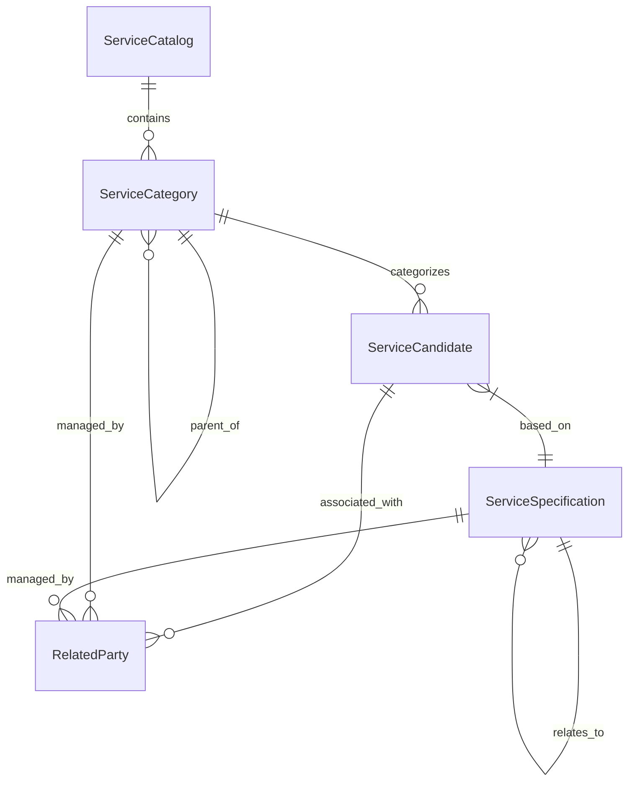

# 4. Entities

This section describes the domain entities, their relationships, and data definitions used within the Service Catalog system.

## 4.1 Entity-Relationship Diagram (ERD)

The following diagram illustrates the relationships between the primary domain models.

## 4.2 Detailed Entity Definitions

### ServiceCandidate
Represents a service offered in the catalog, acting as an instance or a candidate for a specific service specification.

| Property Name | Type | Description |
| :--- | :--- | :--- |
| `id` | `string` | Unique identifier of the service candidate |
| `name` | `string` | Name of the service candidate |
| `description` | `string` | Detailed description of the service |
| `lifecycleStatus` | `string` | Current status in the lifecycle (e.g., Active, Retired) |
| `validFor` | `TimePeriod` | Time period during which the candidate is valid |
| `version` | `string` | Version of the candidate entity |
| `href` | `string` | Resource URL reference |
| `category` | `Array<ServiceCategoryRef>` | Categories the candidate belongs to |
| `serviceSpecification` | `ServiceSpecificationRef` | The underlying specification this candidate implements |
| `aclRelatedParty` | `Array<RelatedParty>` | Parties with access or relationship to this candidate |

**Constraints:**
- `serviceSpecification` is required when creating a new `ServiceCandidate`.

---

### ServiceCategory
Defines the hierarchical categorization of services.

| Property Name | Type | Description |
| :--- | :--- | :--- |
| `id` | `string` | Unique identifier of the category |
| `name` | `string` | Name of the category |
| `description` | `string` | Description of the category |
| `lifecycleStatus` | `string` | Current lifecycle status |
| `version` | `string` | Version of the category entity |
| `href` | `string` | Resource URL reference |
| `validFor` | `TimePeriod` | Validity period of the category |
| `isRoot` | `boolean` | Indicates if this is a top-level category |
| `parentId` | `string` | Identifier of the parent category |
| `parent` | `ServiceCategoryRef` | Reference to the parent category object |
| `category` | `Array<ServiceCategoryRef>` | List of child categories |
| `serviceCandidate` | `Array<ServiceCandidateRef>` | Services associated with this category |
| `aclRelatedParty` | `Array<RelatedParty>` | Parties associated with this category |

**Constraints:**
- Hierarchical structure is maintained via `parentId` and `category` (children) list.

---

### ServiceSpecification
The blueprint or template that defines the characteristics and rules for a service.

| Property Name | Type | Description |
| :--- | :--- | :--- |
| `id` | `string` | Unique identifier of the specification |
| `name` | `string` | Name of the specification |
| `description` | `string` | Description of the specification |
| `lifecycleStatus` | `string` | Lifecycle status (default: 'In study') |
| `version` | `string` | Version of the specification |
| `href` | `string` | Resource URL reference |
| `validFor` | `TimePeriod` | Validity period |
| `isBundle` | `boolean` | Whether this is a bundle of multiple specifications |
| `bundledServiceSpecification` | `Array<BundledServiceSpecification>` | Specifications included in this bundle |
| `specCharacteristic` | `Array<CharacteristicSpecification>` | Defined characteristics of the service |
| `serviceSpecRelationship` | `Array<ServiceSpecRelationship>` | Relationships to other specifications |
| `relatedParty` | `Array<RelatedParty>` | Parties with interest in this specification |
| `aclRelatedParty` | `Array<RelatedParty>` | Access control related parties |

**Constraints:**
- `lifecycleStatus` defaults to 'In study' upon creation.

---

### ServiceCatalog
The top-level container for service categories and their associated candidates.

| Property Name | Type | Description |
| :--- | :--- | :--- |
| `name` | `string` | Name of the service catalog |
| `description` | `string` | Description of the catalog |
| `lifecycleStatus` | `string` | Current lifecycle status |
| `category` | `Array<ServiceCategoryRef>` | Categories included in this catalog |
| `catalogType` | `string` | Identifier for the type of catalog |
| `validFor` | `TimePeriod` | Validity period of the catalog |
| `relatedParty` | `Array<RelatedParty>` | Related parties for the catalog |
| `aclRelatedParty` | `Array<RelatedParty>` | Access control parties |

## 4.3 Data Types Mapping

| TypeScript Type | Conceptual Data Type | Description |
| :--- | :--- | :--- |
| `string` | `String / UUID` | Textual data or unique identifiers |
| `number` | `Integer / Decimal` | Numeric values (e.g., revision numbers) |
| `boolean` | `Boolean` | True/False flags |
| `Date` | `DateTime` | ISO date and time stamps |
| `Array<T>` | `Collection` | List of related entities or references |
| `TimePeriod` | `Interval` | Object containing `startDateTime` and `endDateTime` |
| `Ref` (e.g. `ServiceCategoryRef`) | `Reference` | A lightweight pointer to another entity (usually containing `id` and `href`) |

## 4.4 Common Patterns

Across the domain models, several recurring patterns are identified:

1. **Identity and Versioning**: Most entities implement `id`, `version`, and `href` for resource identification and tracking.
2. **Lifecycle Management**: `lifecycleStatus` is a standard property across all primary entities, governed by the `LIFE_CYCLE_STATUS` enum.
3. **Temporal Validity**: The `validFor` property (of type `TimePeriod`) is used consistently to define the active window of an entity.
4. **Access Control**: `aclRelatedParty` is used to manage party-based permissions and associations.
5. **Audit Metadata**: `ServiceCategory` and `ServiceSpecification` include audit fields: `createdBy`, `updatedBy`, `createdDate`, `updatedDate`, and `revision`.
